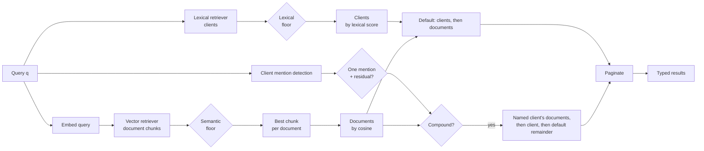

# PRD — Unified Search

---

## 0. How to read this document

| Document | Role |
|---|---|
| [assignment.md](assignment.md) | The original brief. Source of truth for what is being graded. |
| **prd.md** (this) | Product definition and behavioural spec. **Source of truth for system design.** Where the documents above disagree, this document reconciles them. |
| [system-design.md](system-design.md) | Technical design: architecture, data model, API contract, and non-functional requirements. |

---

## 1. Problem

Financial advisors at Registered Investment Advisers (RIAs) spend ~80% of their time on administration rather than advice. The root cause is structural: client data is scattered across CRM, multiple custodians (each with a different data model), portfolio reporting, planning tools, document storage, and email. Staff bridge the gaps manually — re-keying data and maintaining spreadsheet "shadow data" — which produces errors and audit-trail gaps.

When data lives in ten systems, the highest-leverage feature is not an eleventh system. It is **one search box that answers across all of them**.

That is what this product is. An advisor types a fragment of what they remember — a firm name, a document category, a half-recalled phrase — and gets back the relevant clients *and* documents in one ranked list, without knowing in advance which kind of thing they were looking for.

### 1.1 Why this is hard

The two things advisors search for have incompatible retrieval characteristics:

- **Clients** are short, structured records. Queries are identifiers — names, emails, firm names. The *string itself* is the signal. Embeddings are actively bad at this: they encode meaning, not characters.
- **Documents** are free text. Queries are categories and paraphrases — the advisor's words rarely appear in the document. Lexical matching is actively bad at this: there are no shared tokens between "address proof" and "utility bill".
- **Compound queries** name both a client and a category. "John utility bill" needs the client as a qualifier on semantic results rather than as the result itself.

Neither retrieval method subsumes the other. The system must run both and merge them into one ordering — which is the central design problem.

---

## 2. Users and jobs

**Primary user:** a financial advisor or their operations staff, mid-workflow — often with a client on the phone or minutes before a meeting. Latency is felt directly.

### 2.1 Jobs to be done

| JTBD | Trigger | Success looks like |
|---|---|---|
| **J1 — Organizational lookup** | Meeting with a firm; an intro arrives from one | Every **contact** connected to that organization, found by firm name alone |
| **J2 — Category-to-artifact retrieval** | Onboarding a client; KYC checklist item | The document satisfying a *regulatory category*, found without knowing the artifact's title |
| **J3 — Fuzzy person lookup** | Half-remembered name, misspelling, partial email | The one right client, first result |
| **J4 — Client-scoped category retrieval** | Working a KYC checklist for a client already in mind | That client's artifact first, followed by the client that qualified it |

---

## 3. Scope

### 3.1 In scope

- Client creation and retrieval
- Document creation under a client, with content indexed for semantic retrieval
- Unified search across both, single ranked response
- LLM-generated document summaries, generated on explicit request — **optional**: the brief lists summarization as optional, and nothing else in the system depends on it
- API-key authentication
- Pagination on search — **optional**: the brief does not ask for it
- Local, reproducible deployment via `docker compose up`, with a React UI for advisor workflows and Swagger UI for API exploration
- Production deployment on Cloud Run + Cloud SQL. The brief calls deployment a "plus"; the graded deliverable is still the local system

### 3.2 Out of scope — and why

| Excluded | Reason |
|---|---|
| Lexical retrieval over documents | The brief scopes documents to similarity matching. Named as a cut, not an oversight |
| Load testing | Latency is stated as reasoning and instrumented, not benchmarked |
| Multi-tenancy (firm isolation), advisor accounts, RBAC | Considered and deliberately excluded. A single shared API key and a single tenant are sufficient for the demo |
| Document update and delete | No API is exposed; documents are only created |
| File upload / PDF parsing | Brief's schema takes `content` as plain text |
| Cross-encoder reranking | Standard in full production stacks, correctly cut at ~10⁴ documents. Named as a scale-aware decision, not an oversight |
| Document versioning, audit history | Not in the brief |
| Conversational RAG / Q&A over documents | The brief asks for search and summarization, not retrieval-augmented generation |
| Change streams, external index synchronization | Indexing happens inside the write transaction; there is no external index to sync |
| i18n | Seed corpus, eval set and success criteria are English-only |
| Sharding, multi-region | Beyond the scale in 4 |

---

## 4. Scale assumptions

Sized for the assignment, stated so the design's limits are visible:

| Dimension | Assumption |
|---|---|
| Clients | ~10³ |
| Documents | ~10⁴ |
| Concurrent users | 100 advisers |
| Workload | **Read-heavy.** Search dominates; client and document creation is comparatively rare |
| Corpus growth | **Create-only.** No update or delete API is exposed; clients and documents are only ever created |

**Read and write paths are decoupled.** Writes (chunking, embedding, persisting) must not degrade search latency, and each path must be able to scale independently of the other.

**Re-indexing never leaves a gap.** Changing the chunking strategy or the model version requires rebuilding vectors for existing documents. That runs as a separate offline process, not on the write path — and because the existing vectors stay live until their replacements land, a re-indexed document is briefly *stale*, never *absent*.

**Consequence:** exact (brute-force) vector scan is acceptable and correct at this size. An ANN index (e.g. HNSW) is deferred until measurement shows it is needed — building it preemptively optimizes something not yet slow. Because the corpus is create-only, adding one later is a build over existing rows, not a redesign.

---

## 5. Functional specification

### 5.1 Data model

```
Client
  id             uuid, server-generated
  first_name     text, case-insensitive, required
  last_name      text, case-insensitive, required
  email          case-insensitive, required, unique
  description    text, case-insensitive, optional
  social_links   case-insensitive list of URLs, optional
  created_at     timestamp

Document
  id             uuid, server-generated
  client_id      → Client
  title          text, required
  content        text, required
  summary        text, optional
  summary_status none | pending | ready | failed
  created_at     timestamp

DocumentChunk
  id             uuid, server-generated
  document_id    → Document
  ordinal        position within the document
  text           the chunk itself, returned as the match passage
  embedding      semantic index over this chunk
```

**Email is unique.** A duplicate email, differing only by case, is rejected as a conflict.

**Case-insensitivity above is a matching property, not a storage one.** Every client field is compared without regard to case. `email` is the one field that is additionally *stored* case-insensitively, because uniqueness has to hold across case.

**Documents are embedded per chunk, not as a whole.** A single vector per document would be truncated at the model's input limit, leaving everything past the first few hundred words invisible to search — a partial failure that surfaces as nothing at all, since the document still matches *some* queries. Chunking also produces the passage a search result needs: there is something concrete to point at when explaining why a document matched.

### 5.2 Retrieval — clients (lexical)

Matches against `first_name`, `last_name`, `email`, `description`, and **`social_links`**.

**Mandatory behaviour — J1.** Query `"NevisWealth"` must return the client whose email is `john.doe@neviswealth.com`.

> **This is the single sharpest technical constraint in the brief.** Postgres full-text search tokenizes `john.doe@neviswealth.com` as one indivisible `email` token. A textbook `to_tsvector`/`tsquery` implementation **fails the brief's own first example.** Satisfying it requires decomposing identifiers on their structural delimiters (`@ . - / _`) and indexing the fragments — or trigram matching, or case-insensitive substring search.

`social_links` is included because a LinkedIn company URL carries the same organizational signal as an email domain, and decomposes the same way. This is likely *why* the field appears in the brief's schema at all.

Matching must be case-insensitive and must match on partial tokens (`"Nevis"` also hits). Fuzzy similarity is retained deliberately, so J3's misspelling case works.

**A client relevance threshold is mandatory, and it is the highest-risk number in the system.** Because clients rank above documents, a client that clears the threshold is promoted above *every* document — so the threshold alone decides both of the brief's examples, in opposite directions. Too loose and a faintly-matching client outranks the utility bill, failing J2. Too strict and `"Nevis"` returns nothing, failing J1. Matches below it are **dropped, not demoted**. It is tuned against the eval set, which asserts absence as well as presence.

**Client matching also recognises a client named inside a longer query.** This uses individual query tokens against client identity, rather than the whole-query threshold: extra category words would otherwise dilute `"John utility bill"` until John is invisible. Exactly one recognised client plus an unmatched residual term activates J4; no residual preserves name-only J1/J3 behaviour, and two recognised clients are ambiguous and keep the default order.

### 5.3 Retrieval — documents (semantic)

The query is embedded by the same model that embedded the documents and compared by cosine similarity against stored **chunk** embeddings. A document's score is its best-matching chunk's score, and that chunk is returned as the passage.

**Mandatory behaviour — J2.** Query `"address proof"` must return documents containing `"utility bill"`, with no shared keywords.

**What this actually requires is category-to-instance generalization.** In wealth onboarding, "proof of address" is a regulatory *category* satisfied by several artifact types — utility bill, bank statement, council tax bill, tenancy agreement. "Proof of identity" is satisfied by passport, driver's licence, national ID. The advisor thinks in categories; documents are titled with artifact types. Semantic search bridges exactly that gap. This is a fair test for a general-purpose embedding model, not an exotic one.

**Embedding input is `title + content`**, not content alone. The brief says "based on similar terms from its content"; including the title is a minor, deliberate deviation — titles in this domain are highly informative ("2024 Utility Bill — Henderson") and excluding them discards signal. Documented as a deviation in the README.

**A relevance floor is mandatory.** Vector search over a small corpus always returns *something*; the nearest neighbour to an unrelated query is noise. Below-threshold results are dropped so an unrelated query returns an empty list rather than the least-bad match. The threshold is tuned empirically against the seed corpus, not guessed.

### 5.4 Merge and ranking

**Decision: deterministic ordering by provenance.** Each retriever applies its own relevance floor, then results are ordered by *where they came from* rather than by any score comparison across types. Below-floor matches are **dropped, not demoted**.

Clients lead documents by default: clients are ordered by lexical score and documents by cosine. For J4, exactly one recognised client plus a residual category term promotes only that client's already-qualified semantic documents, then the client, then all remaining clients and documents in default order. Mention detection never adds or removes a document; it changes only the ordering of results that cleared their own floors.

**Why not Reciprocal Rank Fusion.** RRF is the standard answer when several retrievers rank *the same corpus*: an item appearing in multiple lists accumulates score, and that accumulation is the entire mechanism. Here the corpora are **disjoint** — clients come only from the lexical retriever, documents only from the vector retriever — so every item appears in exactly one list and the sum always has exactly one term:

```
client at lexical rank 1  →  1/(k+1)
doc    at vector  rank 1  →  1/(k+1)      ← identical, for any k
```

The score is then monotonic in rank with nothing to accumulate, so `k` has no effect on the ordering and the result is a strict round-robin interleave of the two lists, tied at every position. The ranking would in fact be decided by an unspecified tie-break, and the published benchmark gains for RRF — which come from multi-list overlap — would not apply. It would be a respectable-sounding name for alternating two lists.

**Why not a normalized blend.** Trigram similarity and cosine similarity are not on the same scale and never will be; mapping both into `[0,1]` produces two numbers that look comparable and are not, plus a weighting constant with no principled value.

**Why clients first, by default.** A lexical hit is a high-precision signal: an advisor typing a name, firm or email fragment is naming a *specific record* they already know exists. A semantic hit is recall-oriented and inherently fuzzier. Precision before recall is the right default — and the client relevance floor is what keeps it safe, because a query with no genuine client match must yield *no* clients rather than weak ones promoted above good documents.

The ordering is total and deterministic, and pagination is a slice of the chosen concatenation rather than a re-fusion.



The two retrievers are independent and run concurrently. This is a real seam — different implementations, different failure modes — and it is what makes the ordering logic unit-testable in isolation.

**If either retriever fails, the whole search fails.** Because they run concurrently they can fail independently: the embedding step or the vector query can break while lexical matching still works, and vice versa. Serving the surviving half would return a ranked list that silently omits an entire type — an advisor searching `"address proof"` would get an empty list that looks exactly like "no such document", with nothing in the response to say a retriever was down. That is the same silent under-return the write path refuses, arriving by a different route. The request errors instead, so the caller knows the answer is unavailable rather than believing it is empty. The cost is accepted: one broken retriever takes search down rather than degrading it, and partial results are never returned even when they would have been correct.

### 5.5 Search results

Each result identifies its type (client or document), carries the entity, its retriever's score, and why it matched — the matched field for a client, the best-matching chunk as a passage for a document. Scores are comparable *within* a type, not across types. A result's **position** reflects provenance rather than score: J4 places the named client's qualified documents before that client. A query with no matches above the relevance floors returns an empty list, not an error. Results are paginated, and the caller can tell how many matches exist in total.

### 5.6 Write path

Clients are created independently; documents are created under an existing client. Malformed input and a duplicate email are rejected; a document for a nonexistent client is rejected.

**Both entities are searchable the moment creation succeeds.** No separate indexing call. A client is searchable immediately — lexical retrieval reads its columns directly. A document's row and **all** of its chunk embeddings commit in one transaction: if embedding fails, the write fails and returns an error, rather than returning `201` for a document search cannot see.

Embedding in-process costs milliseconds per chunk, so for a typical KYC document this guarantee is effectively free. Cost is linear in length, which is why the creation target is sized to the largest document accepted rather than the typical one. It would be expensive to keep this guarantee against a remote embedding API, which is one more reason the model is local.

**Re-indexing is separate.** Rebuilding vectors for existing documents — a new chunking strategy, a new model version — runs offline, outside the write path, replacing chunks per document. Existing vectors stay live until their replacements commit, so a document being re-indexed is briefly stale but never unsearchable.

### 5.7 Summaries

Generated by an LLM **on explicit request**, never as a side effect of creation or of reading a document.

A created document is `none` — nothing has been asked for. Requesting a summary is its own action on the document, accepted immediately and processed by a durable worker; `summary_status` moves `pending` → `ready` or `failed` while the caller polls. Repeating the request while `pending` is a no-op, and requesting again after `failed` is an explicit, bounded retry that resets the attempt count.

```
none  ──request──▶  pending  ──▶  ready
  ▲                    │
  └──── (terminal) ────┴──▶  failed  ──request──▶  pending
```

**Four states, not three.** `none` and `pending` must be distinguishable or a polling client cannot tell "nobody has asked" from "a job is already running" — and would either wait forever on a job that was never started, or start a second one.

**Why request-triggered.** Summarization is the one operation here with real per-call cost and multi-second latency, and most documents are never opened. Keeping it off the write path means creation stays fast and predictable, and cost is proportional to attention rather than to corpus size. Keeping it off the *read* path means an ordinary `GET` stays idempotent, cacheable, and incapable of spending money.

**Failure must not degrade search.** If the model is unreachable, unauthenticated, or rate-limited: the document is still created, still embedded, still searchable; the status becomes `failed` and nothing else changes. Search never reads `summary`. With no API key configured, every request fails cleanly this way — which is exactly how `docker compose up` behaves with zero credentials.

### 5.8 Auth

Static API key by header, supplied via environment. Requests without a valid key are rejected. Health, the OpenAPI spec, and Swagger UI stay unauthenticated so a running instance is explorable.

### 5.9 Client surface

A React SPA is the primary advisor surface. Its home page lists clients and provides unified search; client details, documents, and client creation are available as separate routes. Advisors supply the API key in the UI. Swagger UI remains unauthenticated for API exploration, and the README carries J1, J2 and J3 as worked request/response examples.

---

## 6. Success criteria

**The two brief examples exist as automated tests** — J1 (`"NevisWealth"` → the client) and J2 (`"address proof"` → the utility-bill document). These are the assignment's own acceptance criteria; they must be executable, not asserted in prose.

**A relevance evaluation set of ~10 query→expected-result pairs runs as a test**, drawn from KYC vocabulary (proof of address → utility bill / bank statement; proof of identity → passport / driver's licence; source of funds → sale of property; etc.). This turns "semantic search works" from an assertion into evidence, and directly addresses the "correctness" axis the brief says it grades.

**The eval set asserts absence as well as presence.** Every case states which results must *not* appear — `"address proof"` must return **zero clients**, `"NevisWealth"` must return exactly the one. Presence-only assertions cannot catch a too-loose client threshold, which is the specific way J2 breaks now that clients outrank documents. Both relevance floors are tuned against this set, and a regression in either direction fails the build.

**The eval set also asserts ordering, not just membership.** A default client and document hit retains client-first provenance order. A compound query must return the named client's document first and that client second, while a name-only query remains client-first.

**The seed corpus is a realistic KYC/onboarding document set** — utility bill, bank statement, passport summary, W-9, tax return, engagement letter — not a contrived synonym pair. It demonstrates the actual J2 workflow.

**Performance targets — stated, not measured.** Search p99 < 300 ms; document creation p99 < 1 s, chunking and embedding included. The creation figure is sized to the largest document accepted, since embedding cost is linear in length. These are design targets derived in the system design's performance section; **no load test is run** and the numbers are not benchmarked. Per-stage timers are in place to measure them in operation, which is where the figures that matter would come from anyway.

**Reproducibility:** `docker compose up` yields a working, seeded system that demonstrably satisfies J1 and J2 **with zero external credentials**.

---

## 7. Deployment

**Two targets: local and Cloud Run.** Local is the development target; Cloud Run is production.

### 7.1 Local

`docker compose up` brings up the full system with no external credentials. Schema and extensions are created by versioned Flyway migrations, never `ddl-auto`.

The embedding model is baked into the image or fetched at build time — **never downloaded at first request**, which would make cold start unpredictable and break in network-restricted environments. Its resident footprint is the least obvious cost of running inference in-process, and it sets the image budget.

Summaries need one environment variable (an LLM API key). Without it the system runs unchanged and summaries report `failed`.

### 7.2 Cloud Run (production)

Cloud Run + Cloud SQL (Postgres with `pgvector`, `pg_trgm`, `citext`), ≥2 GiB memory for the in-process model, and secrets from Secret Manager in place of environment variables. The existing Cloud SQL instance is used as-is: the application owns a `unified_search` schema in it, and Flyway migrations create everything else on first app startup.

**Deployment pipeline:**
1. Secret Manager — the database password, `API_KEY`, and optionally `GEMINI_API_KEY`, so summaries stay optional
2. Build a `linux/amd64` image and push it to Artifact Registry
3. `gcloud run deploy` with the Cloud SQL instance attached
4. Cloud Run assigns a default `*.run.app` HTTPS URL automatically

The `cloudrun` Spring profile (`application-cloudrun.yaml`) sizes the HikariCP pool; the Cloud SQL socket factory is a runtime dependency selected by `DB_URL`. See `README.md` for the commands.

---

## 8. Design decisions

### 8.1 One embedding model, open-source and in-process

**Primarily a right-sizing decision.** At 10³ clients and 10⁴ documents, a small general-purpose model is sufficient for the category-to-instance generalization J2 requires. A hosted embedding API would add a network round trip to every query — against a p99 < 300 ms budget — plus a per-query cost and a new failure mode on the critical path, in exchange for relevance gains there is no evidence this corpus needs. That trade only becomes attractive when measurement says the local model is the bottleneck, and it isn't.

Two consequences follow, and both are load-bearing rather than incidental:

- **Document content never leaves the process.** RIAs operate under Rule 204-2, and Nevis advertises SOC 2 Type II and that client data never trains models. Embeddings are the mandatory path — every document, every search — so keeping them local means the core feature has no third-party data egress at all. Summaries are the scoped exception: they send content to an LLM, they are opt-in, and disabling them removes the egress entirely.
- **Embedding is cheap enough to be synchronous.** Milliseconds per document, in-process, which is what lets the write path commit a document and its vectors in one transaction and still meet the creation budget. A remote API would have made that guarantee expensive and pushed the design toward asynchronous indexing it does not otherwise need.

**There is exactly one model, and the vector width is fixed.** Query and documents are always embedded by the same model; a corpus embedded by one model cannot be searched with another, and `pgvector` fixes the dimension in the column type. Changing models is therefore a re-index, not a configuration change — which is the honest cost, and the reason not to build a provider abstraction that would imply otherwise.

**Stored vectors record which model produced them**, so this rule is enforced by the data rather than by discipline. Two different models can share a vector width, in which case a mismatch would otherwise produce confidently wrong results with no error anywhere — the silent-failure class this document keeps ruling out.

### 8.2 Deterministic ordering by provenance, over rank fusion

RRF would have degenerated to round-robin interleaving over these disjoint corpora.

Type is the ordering key: clients always precede documents, and scores are never compared across retrievers.

### 8.3 Cuts taken deliberately

- **Multi-tenancy (firm isolation)** — considered and excluded. The real product is multi-tenant B2B, where 7% of firms hold 77% of assets, and a tenant column is cheap to add early and expensive to retrofit. The demo has one tenant and one shared API key, so isolation would be untested scaffolding with no behaviour to verify. Adding it later means a tenant column on both entities, a scoped uniqueness constraint on email, and a tenant filter on every query.
- **Cross-encoder reranking** — real relevance gains in production stacks, but adds latency and a second hosted model for a corpus small enough that base retrievers are unlikely to need correcting. One README sentence as "what we'd add at 10× scale."
- **ANN index (HNSW)** — deferred until exact scan measurably slows.
- **General entity resolution** — delimiter tokenization is the right-sized answer at 10³ clients.
- **Lexical retrieval over documents** — would make documents findable by firm name and give the ranking real multi-list evidence to fuse. Cut because the brief scopes documents to similarity matching, and following it exactly is worth more here than a superset nobody asked for.
- **Load testing** — the brief asks for tests of core logic and edge cases, not a benchmark harness. Latency is stated as reasoning with its assumptions exposed, and instrumented so it can be measured in operation.

---

## 9. Open questions

1. **Client threshold value.** Empirical, against the eval set's positive *and* negative cases. The riskiest number in the system.
2. **Document relevance floor value.** Empirical, against the seed corpus.
3. **Chunk size and overlap.** Bounded above by the model's input limit; the value within that bound is empirical and affects both passage quality and vector count.
