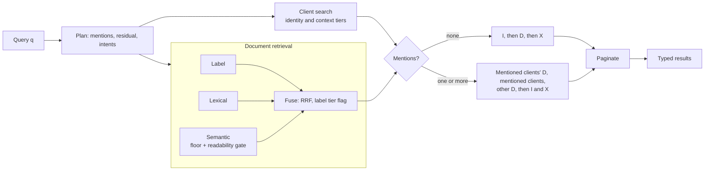

# PRD — Unified Search

---

## 0. How to read this document

| Document | Role |
|---|---|
| **prd.md** (this) | Product definition and behavioural spec. **Source of truth for system design.** Where the documents disagree, this document reconciles them. |
| [system-design.md](system-design.md) | Technical design: architecture, data model, API contract, and non-functional requirements. |

---

## 1. Problem

Financial advisors at Registered Investment Advisers (RIAs) spend ~80% of their time on administration rather than advice. The root cause is structural: client data is scattered across CRM, multiple custodians (each with a different data model), portfolio reporting, planning tools, document storage, and email. Staff bridge the gaps manually — re-keying data and maintaining spreadsheet "shadow data" — which produces errors and audit-trail gaps.

When data lives in ten systems, the highest-leverage feature is not an eleventh system. It is **one search box that answers across all of them**.

That is what this product is. An advisor types a fragment of what they remember — a firm name, a document category, a half-recalled phrase — and gets back the relevant clients *and* documents in one ranked list, without knowing in advance which kind of thing they were looking for.

### 1.1 Why this is hard

The two things advisors search for have incompatible retrieval characteristics:

- **Clients** are short, structured records. Queries are identifiers — names, emails, firm names. The *string itself* is the signal. Embeddings are actively bad at this: they encode meaning, not characters.
- **Documents** are free text. Queries are categories and paraphrases — the advisor's words rarely appear in the document. Lexical matching alone is bad at this: there are no shared tokens between "address proof" and "utility bill".
- **Similarity alone has no notion of what a document is *for*.** A council tax bill can outrank a W-9 for "US tax residency" because it literally says "residency". Word overlap beats meaning, and a system that only measures similarity cannot tell address evidence from tax-status evidence.
- **Compound queries** name both a client and a category. "John utility bill" needs the client as a qualifier on document results rather than as the result itself.

No single retrieval method subsumes the others. The system must run several and merge them into one ordering — which is the central design problem.

---

## 2. Users and jobs

**Primary user:** a financial advisor or their operations staff, mid-workflow — often with a client on the phone or minutes before a meeting. Latency is felt directly.

### 2.1 Jobs to be done

| JTBD | Trigger | Success looks like |
|---|---|---|
| **J1 — Organizational lookup** | Meeting with a firm; an intro arrives from one | Every **contact** connected to that organization, found by firm name alone |
| **J2 — Category-to-artifact retrieval** | Onboarding a client; KYC checklist item | The document satisfying a *regulatory category*, found without knowing the artifact's title |
| **J3 — Fuzzy person lookup** | Half-remembered name, misspelling, partial email | The one right client, first result |
| **J4 — Client-scoped category retrieval** | Working a KYC checklist for a client already in mind | That client's artifact first, followed by the client that qualified it |

---

## 3. Scope

### 3.1 In scope

- Client creation and retrieval
- Document creation under a client, with content indexed for retrieval: a type and a set of KYC purposes from a closed taxonomy, assigned at ingest by a deterministic classifier, plus chunked embeddings
- Unified search across both, single ranked response
- LLM-generated document summaries, generated on explicit request — **optional**: nothing else in the system depends on it
- API-key authentication
- Pagination on search — **optional**: the core search does not need it
- Local, reproducible deployment via `docker compose up`, with a React UI for advisor workflows and Swagger UI for API exploration
- Production deployment on Cloud Run + Cloud SQL, in addition to the local system, which remains the primary target

### 3.2 Out of scope — and why

| Excluded | Reason |
|---|---|
| LLM classification in the write path | Classification is a deterministic rules function of title and content: zero latency, no credentials, reproducible. A model call would put a network dependency on every document creation |
| Load testing | Latency is stated as reasoning and instrumented, not benchmarked |
| Multi-tenancy (firm isolation), advisor accounts, RBAC | Considered and deliberately excluded. A single shared API key and a single tenant are sufficient for the demo |
| Document update and delete | No API is exposed; documents are only created |
| File upload / PDF parsing | A document's `content` is plain text |
| Cross-encoder reranking | Standard in full production stacks, correctly cut at ~10⁴ documents. Named as a scale-aware decision, not an oversight |
| Document versioning, audit history | Not part of the product |
| Conversational RAG / Q&A over documents | The product does search and summarization, not retrieval-augmented generation |
| Change streams, external index synchronization | Indexing happens inside the write transaction; there is no external index to sync |
| i18n | Seed corpus, eval set and success criteria are English-only |
| Sharding, multi-region | Beyond the scale in 4 |

---

## 4. Scale assumptions

Sized for the demo corpus, stated so the design's limits are visible:

| Dimension | Assumption |
|---|---|
| Clients | ~10³ |
| Documents | ~10⁴ |
| Concurrent users | 100 advisers |
| Workload | **Read-heavy.** Search dominates; client and document creation is comparatively rare |
| Corpus growth | **Create-only.** No update or delete API is exposed; clients and documents are only ever created. Reclassification after a taxonomy change is the one internal write, and it changes labels only |

**Read and write paths are decoupled.** Writes (classifying, chunking, embedding, persisting) must not degrade search latency, and each path must be able to scale independently of the other. Today they share one process and one database, split into separate modules that never import each other, so a later service split is routing and wiring rather than a rewrite.

**Nothing is ever briefly absent.** Documents carry the taxonomy version they were labelled under. After a taxonomy change, older rows are reclassified at startup, in batches, without blocking readiness — a document being reclassified is briefly *stale*, never *absent*. Changing the embedding model or chunking strategy requires rebuilding vectors for existing documents; that is a separate offline re-index, not part of the write path, and no such job ships today. Stored vectors record the model that produced them so a model change cannot silently mix vector spaces.

**Consequence:** exact (brute-force) vector scan is acceptable and correct at this size (about 4×10⁴ chunks). An ANN index (e.g. HNSW) is deferred until measurement shows it is needed — building it preemptively optimizes something not yet slow. Because the corpus is create-only, adding one later is a build over existing rows, not a redesign.

---

## 5. Functional specification

### 5.1 Data model

```
Client
  id             uuid, server-generated
  first_name     text, case-insensitive, required
  last_name      text, case-insensitive, required
  email          case-insensitive, required, unique
  description    text, case-insensitive, optional
  social_links   case-insensitive list of http(s) URLs, optional
  created_at     timestamp

Document
  id                     uuid, server-generated
  client_id              → Client
  title                  text, required
  content                text, required
  summary                text, optional
  summary_status         none | pending | ready | failed
  document_type          one of the taxonomy's types, or unknown
  purposes               zero or more taxonomy purposes
  classification_source  request | rule | llm | unknown
  taxonomy_version       version of the taxonomy that labelled it
  created_at             timestamp

DocumentChunk
  document_id       → Document
  kind              label | body
  ordinal           position within the document (label is 0)
  start, end        offsets into the document's content (body chunks)
  embedding_model   the model that produced the vector
  embedding         semantic index over this chunk
```

**Email is unique.** A duplicate email, differing only by case, is rejected as a conflict.

**Case-insensitivity above is a matching property, not a storage one.** Every client field is compared without regard to case. `email` is the one field that is additionally *stored* case-insensitively, because uniqueness has to hold across case.

**Documents are embedded per chunk, not as a whole.** A single vector per document would be truncated at the model's input limit, leaving everything past the first few hundred words invisible to search — a partial failure that surfaces as nothing at all, since the document still matches *some* queries. Chunking also produces the passage a search result needs: there is something concrete to point at when explaining why a document matched. A passage is always taken from a body chunk, never from the label chunk.

**Every document also has one label chunk.** It is a short vector that says what the document *is* (its title and its labels), written in the query's own space. It gives the semantic signal a clean target for paraphrases no synonym list anticipates ("where did the money come from"), and it is immune to dilution by long content.

**Taxonomy.** Twelve document types and seven purposes, plus `unknown`. A purpose is the KYC question a document answers: `proof_of_address`, `proof_of_identity`, `tax_status`, `source_of_funds`, `fees_and_terms`, `investment_mandate`, `trust_structure`. A type has default purposes (a utility bill, council tax bill, bank statement and tenancy agreement all satisfy `proof_of_address`), and a document-creation request may override the type and purposes. The taxonomy is one file shared by the classifier and the query planner, so labels and query intents use the same vocabulary. See [system-design.md](system-design.md) for the full table.

### 5.2 Retrieval — clients (lexical)

Matches against `first_name`, `last_name`, `email`, `description`, and **`social_links`**, in two tiers:

- **Identity tier:** name, email and social links. A hit is the advisor naming a specific record they already know exists.
- **Context tier:** description. A hit is weak evidence.

**Mandatory behaviour — J1.** Query `"NevisWealth"` must return the client whose email is `john.doe@neviswealth.com`.

> **This is the single sharpest technical constraint in the product.** Postgres full-text search tokenizes `john.doe@neviswealth.com` as one indivisible `email` token. A textbook `to_tsvector`/`tsquery` implementation **fails J1 outright.** Satisfying it requires decomposing identifiers on their structural delimiters (`@ . - / _`) and indexing the fragments — or trigram matching, or case-insensitive substring search.

The design uses trigram matching (`pg_trgm` `word_similarity`), which splits on non-alphanumerics and so decomposes emails and URLs, matches partial tokens, and tolerates typos from one built-in.

`social_links` is included because a LinkedIn company URL carries the same organizational signal as an email domain, and decomposes the same way.

Matching must be case-insensitive and must match on partial tokens (`"Nevis"` also hits). Fuzzy similarity is retained deliberately, so J3's misspelling case works.

**A client relevance floor is mandatory, and it is the highest-risk number in the system.** Because identity clients rank above documents, a client that clears the floor is promoted above *every* document — so the floor alone decides both J1 and J2, in opposite directions. Too loose and a faintly-matching client outranks the utility bill, failing J2. Too strict and `"Nevis"` returns nothing, failing J1. Matches below it are **dropped, not demoted**. The floor is 0.6, pg_trgm's default; it is **guarded** by the eval set, which asserts absence as well as presence and pins it from both sides (a misspelling scoring 0.70 must be admitted, a short-name near miss scoring 0.50 must not), but it is never derived from the eval set. The context tier cannot promote a client over a document: description matches are ordered below documents (5.4).

**Client matching also recognises a client named inside a longer query** (a *mention*). This compares individual query tokens against client full names and emails, rather than applying the whole-query floor: extra category words would otherwise dilute `"John utility bill"` until John is invisible.

- Only the leading contiguous run of query tokens counts, so in `"john utility bill"` matching stops at `utility` and a later `bill` never becomes a client named Bill. Very short tokens are skipped.
- **Ambiguity rule.** A single-token mention whose token is also a taxonomy word (`bill`, `statement`, `trust`) counts only if it was possessive (`bill's`) or a second token also matched the same client (`bill carter`). Otherwise it is category text.
- **Ties are kept.** If several clients match equally well (two Johns), the name is ambiguous but the query still names a small known set of people whose documents are the likeliest answers, so all of them are mentions.
- The remainder of the query after the mentions is the *residual*. Mentions have no filtering authority: they change only the order of results that already qualified, never which results appear.

### 5.3 Retrieval — documents (labels, lexical and semantic)

Before retrieval, every query is parsed into a **plan**: the clients it names, the residual text, and the taxonomy *intents* — document types and purposes — that the residual refers to. Document retrieval reads the residual. If the residual is empty (an identity query such as `john`) or reduces to nothing but stop words, no document signal runs and the result holds clients only; embedding stop words would admit documents on noise.

Documents are found by three signals run concurrently:

- **Label.** Every document whose stored type or purposes match a query intent, whatever its wording. This is what makes `"proof of address"` complete: every tagged document is admitted, including bills that never use address wording.
- **Lexical.** A stemmed full-text match over title, labels and content, with terms ANDed for precision. The last term is matched as a prefix when it is three or more letters, since the advisor types into a live box.
- **Semantic.** The query is embedded by the same model that embedded the documents and compared by cosine similarity against stored **chunk** embeddings, over label and body chunks. A document's semantic score is its best-matching chunk's score.

**Mandatory behaviour — J2.** Query `"address proof"` must return documents containing `"utility bill"`, with no shared keywords.

**What this actually requires is category-to-instance generalization.** In wealth onboarding, "proof of address" is a regulatory *category* satisfied by several artifact types — utility bill, bank statement, council tax bill, tenancy agreement. "Proof of identity" is satisfied by passport, driver's licence, national ID. The advisor thinks in categories; documents are titled with artifact types. The purpose labels bridge that gap deterministically, and the semantic signal covers paraphrases the labels' vocabulary misses. This is a fair test for a general-purpose embedding model, not an exotic one.

**Embedding input includes the title**, not content alone: a body chunk is embedded as `title + chunk text`. Titles in this domain are highly informative ("2024 Utility Bill — Henderson") and excluding them discards signal.

**A semantic relevance floor is mandatory.** Vector search over a small corpus always returns *something*; the nearest neighbour to an unrelated query is noise. Below-floor results are dropped so an unrelated query returns an empty list rather than the least-bad match. The floor is a *recall gate* rather than the only barrier: label and lexical admission do not depend on it. It is derived by the eval set as the midpoint between the lowest positive and the highest negative cosine, and the build fails if that gap closes or the configured value drifts from the midpoint.

**A readability gate covers what a floor cannot.** Cosine cannot reject gibberish: random letters can score above the floor. The query embedding therefore also reports whether the model read the query as words, and an unreadable query gets no semantic results. Label and lexical retrieval are unaffected, so identifiers such as account numbers still find documents.

The three signals are merged into one ranked document list by reciprocal rank fusion (5.4).

### 5.4 Merge and ranking

**Decision: deterministic tier ordering, chosen by the shape of the plan.** Each retriever applies its own relevance floor, then results are ordered by *tier* rather than by any score comparison across types. Below-floor matches are **dropped, not demoted**. Scores are never compared across clients and documents.

Three sets feed the ordering: identity clients **I** (the whole query cleared the client floor on name, email or social links), context clients **X** (description only), and the fused documents **D**.

**No mentions** (category queries, free text, and identity hits the mention detector cannot see, such as a social-link URL): **I**, then **D**, then **X**.

**One or more mentions** (identity queries such as `John`, and compound queries such as `John's bill`):

1. **D** for the mentioned clients: in a compound query the client is a qualifier and the document is the target.
2. The mentioned clients, in mention order: confirms who was recognised, even when the whole query did not clear the identity floor.
3. **D** for everyone else: the fallback when the advisor named the wrong person, or the client has no such document.
4. **I** minus the mentioned clients, then **X**.

Ordering is total and deterministic, so pagination is a slice of the chosen concatenation rather than a re-fusion.

**Documents are fused across signals, not across types.** Within documents the three signals rank the *same corpus*: a document found by several signals accumulates evidence, which is exactly what reciprocal rank fusion is for. RRF (`k = 60`) is applied over the two ranked signals, lexical and semantic. Label admission is a *tier flag*, not a score, because "is tagged proof of address" is boolean evidence and mixing it into a sum needs a weight nobody can justify. The sort key is label match, then fused score, then cosine, then recency, then id. A label-only document precedes every untagged one.

**Why not RRF across clients and documents.** The corpora are **disjoint** — clients come only from client search, documents only from document retrieval — so every item appears in exactly one list and the sum always has exactly one term:

```
client at lexical rank 1  →  1/(k+1)
doc    at vector  rank 1  →  1/(k+1)      ← identical, for any k
```

The score is then monotonic in rank with nothing to accumulate, so `k` has no effect on the ordering and the result is a strict round-robin interleave of the two lists, tied at every position. It would be a respectable-sounding name for alternating two lists.

**Why not a normalized blend.** Trigram similarity, full-text rank and cosine similarity are not on the same scale and never will be; mapping them into `[0,1]` produces numbers that look comparable and are not, plus a weighting constant with no principled value.

**Why identity clients lead by default.** A lexical identity hit is a high-precision signal: an advisor typing a name, firm or email fragment is naming a *specific record* they already know exists. A document hit answers a category question, and a description hit is weak evidence, so it is shown but never above the documents it would hide. Precision before recall is the right default — and the client floor is what keeps it safe, because a query with no genuine identity match must yield *no* clients ahead of documents rather than weak ones.



Client search and document retrieval are independent and run concurrently. This is a real seam — different implementations, different failure modes — and it is what makes the ordering logic unit-testable in isolation.

**If any retrieval fails, the whole search fails.** Because they run concurrently they can fail independently: the embedding step or the vector query can break while client matching still works, and vice versa. Serving the surviving half would return a ranked list that silently omits an entire type — an advisor searching `"address proof"` would get an empty list that looks exactly like "no such document", with nothing in the response to say a retriever was down. That is the same silent under-return the write path refuses, arriving by a different route. The request errors instead (`500`), so the caller knows the answer is unavailable rather than believing it is empty. The cost is accepted: one broken retriever takes search down rather than degrading it, and partial results are never returned even when they would have been correct.

### 5.5 Search results

Each result identifies its type (client or document), carries the entity, its retriever's score, and why it matched — the matched field and tier for a client; for a document, the signals that admitted it, its labels, and the best-matching body chunk as a passage. Scores are comparable *within* a type, not across types. A result's **position** reflects tier rather than score: a compound query places the named client's qualified documents before that client. A query with no matches above the relevance floors returns an empty list, not an error. Results are paginated, and the response carries a total count. Each signal fetches at most 200 candidates, so the count is exact below that and a lower bound at it.

### 5.6 Write path

Clients are created independently; documents are created under an existing client. Malformed input and a duplicate email are rejected; a document for a nonexistent client is rejected. A request may name the document's type and purposes; otherwise the classifier assigns them.

**Both entities are searchable the moment creation succeeds.** No separate indexing call. A client is searchable immediately — retrieval reads its columns directly. For a document, classification, chunking and embedding of the label chunk and every body chunk happen first, outside any transaction. Then the document row, its label chunk and **all** of its body chunks commit in one transaction: if embedding fails, the write fails and returns an error, rather than returning `201` for a document search cannot see. Creation makes no model call and no network call.

Embedding in-process costs milliseconds per chunk, so for a typical KYC document this guarantee is effectively free. Cost is linear in length, which is why the creation target is sized to the largest document accepted (64 000 characters) rather than the typical one. It would be expensive to keep this guarantee against a remote embedding API, which is one more reason the model is local.

**Reclassification is separate.** When the taxonomy changes, rows labelled under an older version are reclassified at startup, in batches, replacing labels and the label chunk only. Requested types are kept. Existing labels stay live until their replacements commit, so a document being reclassified is briefly stale but never unsearchable. Rebuilding body vectors for a new model or chunking strategy is a different, offline concern (4).

### 5.7 Summaries

Generated by an LLM **on explicit request**, never as a side effect of creation or of reading a document.

A created document is `none` — nothing has been asked for. Requesting a summary is its own action on the document, accepted immediately and processed by a durable worker (the document table is the queue, with a lease so more than one instance stays correct); `summary_status` moves `pending` → `ready` or `failed` while the caller polls. Repeating the request while `pending` is a no-op, requesting for a document already `ready` is a no-op, and requesting again after `failed` is an explicit, bounded retry that resets the attempt count. A request is retried up to three times before it is marked `failed`.

```
none  ──request──▶  pending  ──▶  ready
                       │
                       └──▶  failed  ──request──▶  pending
```

**Four states, not three.** `none` and `pending` must be distinguishable or a polling client cannot tell "nobody has asked" from "a job is already running" — and would either wait forever on a job that was never started, or start a second one.

**Why request-triggered.** Summarization is the one operation here with real per-call cost and multi-second latency, and most documents are never opened. Keeping it off the write path means creation stays fast and predictable, and cost is proportional to attention rather than to corpus size. Keeping it off the *read* path means an ordinary `GET` stays idempotent, cacheable, and incapable of spending money.

**Failure must not degrade search.** If the model is unreachable, unauthenticated, or rate-limited: the document is still created, still embedded, still searchable; the status becomes `failed` and nothing else changes. Search never reads `summary`. With no API key configured, every request fails cleanly this way — which is exactly how `docker compose up` behaves with zero credentials.

### 5.8 Auth

Static API key by header, supplied via environment. Requests without a valid key are rejected, and the service refuses to start if the key is unset or shorter than 32 characters. Health, the OpenAPI spec, Swagger UI, and the SPA and its static assets stay unauthenticated so a running instance is explorable.

### 5.9 Client surface

A React SPA is the primary advisor surface. Its home page lists clients and provides unified search; client details, documents, and client creation are available as separate routes. Advisors supply the API key in the UI. Swagger UI remains unauthenticated for API exploration, and the README carries J1, J2 and J3 as worked request/response examples.

---

## 6. Success criteria

**J1 and J2 exist as automated tests** — J1 (`"NevisWealth"` → the client) and J2 (`"address proof"` → the utility-bill document). These are the core acceptance criteria; they must be executable, not asserted in prose.

**A relevance evaluation set runs as a test**, currently 34 queries drawn from KYC vocabulary (proof of address → utility bill / bank statement; proof of identity → passport / driver's licence; source of funds → sale of property; identity, compound and ambiguity queries; and negatives). This turns "search works" from an assertion into evidence. Each query declares one expectation: the named item is first, every expected item is within the first *n* positions, a compound ordering, no results, or gibberish rejected by the readability gate. MRR and recall@*n* are logged on every run.

**The eval set asserts absence as well as presence.** Negative queries must return nothing, and every document query asserts that **no client ranks above any expected document** (a context-tier client may appear below the answers). Presence-only assertions cannot catch a too-loose client floor, which is the specific way J2 breaks now that identity clients outrank documents. Both floors are guarded by this set, and a regression in either direction fails the build.

**The eval set also asserts ordering, not just membership.** A compound query must return the named client's document first, only that client's own documents until the client itself, while a name-only query remains client-first.

**The classifier is held to 100% on the labelled seed corpus**, and expected labels are hand-derived from the taxonomy's definition of what answers the question, never read back from a search result.

**The seed corpus is a realistic KYC/onboarding document set** — 50 clients and 126 documents: utility bill, bank statement, passport summary, W-9, tax return, engagement letter — not a contrived synonym pair. It demonstrates the actual J2 workflow.

**Performance targets — stated, not measured.** Search p99 < 300 ms (estimated at about 45 to 110 ms); document creation p99 < 1 s, chunking and embedding included. The creation figure is sized to the largest document accepted, since embedding cost is linear in length. These are design targets derived in the system design's performance section; **no load test is run** and the numbers are not benchmarked. Per-stage timers are in place to measure them in operation, which is where the figures that matter would come from anyway.

**Reproducibility:** `docker compose up` yields a working, seeded system that demonstrably satisfies J1 and J2 **with zero external credentials**.

---

## 7. Deployment

**Two targets: local and Cloud Run.** Local is the development target; Cloud Run is production.

### 7.1 Local

`docker compose up` brings up the full system (PostgreSQL 17 with the extensions, and the app) with no external credentials. Schema and extensions are created by versioned Flyway migrations, never `ddl-auto`.

The embedding model is baked into the image or fetched at build time — **never downloaded at first request**, which would make cold start unpredictable and break in network-restricted environments. Its resident footprint is the least obvious cost of running inference in-process, and it sets the image budget.

Summaries need one environment variable (an LLM API key). Without it the system runs unchanged and summaries report `failed`.

### 7.2 Cloud Run (production)

Cloud Run + Cloud SQL (PostgreSQL 16 with `pgvector`, `pg_trgm`, `citext`), ≥2 GiB memory for the in-process model, and secrets from Secret Manager in place of environment variables. The existing Cloud SQL instance is used as-is: the application owns a `unified_search` schema in it, and Flyway migrations create everything else on first app startup.

**Deployment pipeline:**
1. Secret Manager — the database password, `API_KEY`, and optionally `GEMINI_API_KEY`, so summaries stay optional
2. Build a `linux/amd64` image and push it to Artifact Registry
3. `gcloud run deploy` with the Cloud SQL instance attached
4. Cloud Run assigns a default `*.run.app` HTTPS URL automatically

The `cloudrun` Spring profile (`application-cloudrun.yaml`) sizes the HikariCP pool; the Cloud SQL socket factory is a runtime dependency selected by `DB_URL`. See `README.md` for the commands.

---

## 8. Design decisions

### 8.1 One embedding model, open-source and in-process

**Primarily a right-sizing decision.** At 10³ clients and 10⁴ documents, a small general-purpose model (all-MiniLM-L6-v2, 384 dimensions) is sufficient for the category-to-instance generalization J2 requires, alongside the purpose labels. A hosted embedding API would add a network round trip to every query — against a p99 < 300 ms budget — plus a per-query cost and a new failure mode on the critical path, in exchange for relevance gains there is no evidence this corpus needs. That trade only becomes attractive when measurement says the local model is the bottleneck, and it isn't.

Two consequences follow, and both are load-bearing rather than incidental:

- **Document content never leaves the process.** RIAs operate under Rule 204-2, and Nevis advertises SOC 2 Type II and that client data never trains models. Embeddings are the mandatory path — every document, every search — so keeping them local means the core feature has no third-party data egress at all. Summaries are the scoped exception: they send content to an LLM, they are opt-in, and disabling them removes the egress entirely.
- **Embedding is cheap enough to be synchronous.** Milliseconds per document, in-process, which is what lets the write path commit a document and its vectors in one transaction and still meet the creation budget. A remote API would have made that guarantee expensive and pushed the design toward asynchronous indexing it does not otherwise need.

**There is exactly one model, and the vector width is fixed.** Query and documents are always embedded by the same model; a corpus embedded by one model cannot be searched with another, and `pgvector` fixes the dimension in the column type. Changing models is therefore a re-index, not a configuration change — which is the honest cost, and the reason not to build a provider abstraction that would imply otherwise.

**Stored vectors record which model produced them**, and search filters on it, so this rule is enforced by the data rather than by discipline. Two different models can share a vector width, in which case a mismatch would otherwise produce confidently wrong results with no error anywhere — the silent-failure class this document keeps ruling out.

### 8.2 Deterministic tier ordering, with fusion only where lists overlap

Type and tier decide the order: identity clients, then documents, then context clients, adjusted by mentions. Scores are never compared across clients and documents. RRF would have degenerated to round-robin interleaving over those disjoint corpora, so it is used only where it has something to accumulate — across the ranked signals that retrieve the same documents.

### 8.3 Classification by rules, at ingest

Documents get their type and purposes from a deterministic classifier over title and content, with a closed taxonomy shared by classifier and query planner. This is what lets `"proof of address"` be complete rather than lucky: label admission does not depend on wording or on a similarity threshold. An LLM classifier is deliberately not in the write path, because it would add latency, cost and a failure mode to every creation for a corpus that rules already classify at 100% on the labelled set.

### 8.4 Cuts taken deliberately

- **Multi-tenancy (firm isolation)** — considered and excluded. The real product is multi-tenant B2B, where 7% of firms hold 77% of assets, and a tenant column is cheap to add early and expensive to retrofit. The demo has one tenant and one shared API key, so isolation would be untested scaffolding with no behaviour to verify. Adding it later means a tenant column on both entities, a scoped uniqueness constraint on email, and a tenant filter on every query.
- **Cross-encoder reranking** — real relevance gains in production stacks, but adds latency and a second hosted model for a corpus small enough that base retrievers are unlikely to need correcting. One README sentence as "what we'd add at 10× scale."
- **ANN index (HNSW)** — deferred until exact scan measurably slows.
- **Trigram index on clients** — a sequential scan over ~10³ clients is fast enough; a GIN index is the escape hatch, on measurement.
- **General entity resolution** — delimiter tokenization and trigram similarity are the right-sized answer at 10³ clients.
- **Load testing** — the goal is tests of core logic and edge cases, not a benchmark harness. Latency is stated as reasoning with its assumptions exposed, and instrumented so it can be measured in operation.

---

## 9. Settled parameters

These were open questions and are now resolved. Values live in code and configuration; this list records the decision and how each is guarded.

1. **Client floor: 0.6**, pg_trgm's default, never derived from the eval set and guarded by it from both sides.
2. **Mention threshold: 0.69**, just under the measured score for a one-letter misspelling of a real surname.
3. **Semantic floor: 0.238**, the midpoint of the gap between the lowest positive and highest negative cosine, re-derived by the eval set on every run.
4. **Chunking: 50-word windows on a 40-word stride**, bounded by the model's tokenizer limit, which a test asserts.
