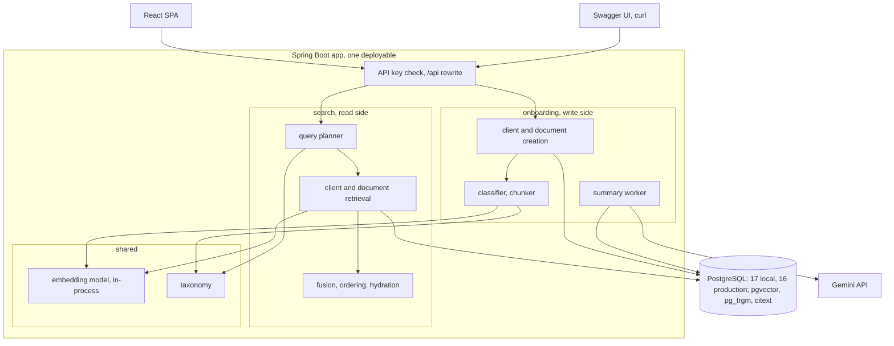
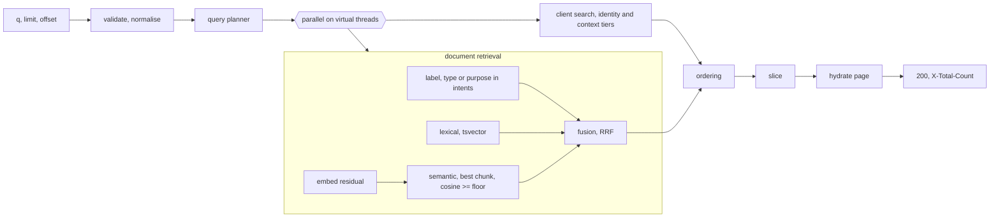

# Unified Search: System Design

One Spring Boot service (Java 25) on one PostgreSQL database with `pgvector`, `pg_trgm` and `citext`: PostgreSQL 17 locally and PostgreSQL 16 on the existing production Cloud SQL instance. Runs locally with `docker compose up`. A React SPA is the primary UI, and Swagger UI is available for API exploration. No broker, cache, ANN index or second service.

- **Documents carry a type and a set of KYC purposes** from a closed taxonomy, assigned at ingest by a deterministic classifier.
- **Every query is parsed into a plan** before retrieval: the client it names, if any, the residual text, and the taxonomy labels that text refers to.
- **Clients** are matched with `pg_trgm` `word_similarity` in two tiers: identity fields (name, email, social links) and context (description).
- **Documents** are retrieved by three signals, label match, lexical match on a `tsvector` and semantic match on MiniLM chunks in `pgvector`, then fused with reciprocal rank fusion.
- **Ordering** is a deterministic tier order chosen by the plan's shape. Scores are never compared across types.
- **Document writes** return `201` only after the document row and all of its chunks commit together, so a search immediately after that response can find the document. **Summaries** are generated on request through Gemini and never touch search.

## Rationale

Similarity alone (embeddings plus a lexical signal) fails on the questions advisors ask, because it has no notion of what a document is *for*.

| Advisor question | Similarity-only outcome | What this solution offers |
|---|---|---|
| `Does Mary Henderson have evidence of US tax residency?` | Council Tax Bills can rank first because they literally say "residency", and word overlap beats meaning | Purpose labels distinguish address evidence from tax-status evidence, so W-9s and tax returns lead |
| `Show me Elena Petrova's source-of-funds evidence` | An engagement letter can rank first because the completion statement's relevant text sits beside GBP figures | A `source_of_funds` label, lexical retrieval over labels and content, and one label chunk per document |
| `Which documents prove Sarah Achebe's address?` | Some bills can be missed because they never use address wording | Label retrieval admits every tagged document, whatever its wording |
| `Find Fatima Al-Sayed's advisory fee agreement` | A client description mentioning advisory arrangements can outrank the agreement | Context matches rank below documents; only identity matches can outrank documents |

## Architecture



The code is three packages: `onboarding` (write side: clients, documents, classification, chunking, summaries, seeding), `search` (read side: planning, retrieval, fusion, ordering, hydration, the audit line) and `shared` (embedding model, taxonomy, web plumbing). Client creation is validate, insert, map the unique violation to `409`, so it has no service layer. Document creation has real logic, so it does.

`onboarding` and `search` run in one process and never import each other. This is an in-process CQRS split: onboarding owns commands and writes, while search owns query planning and its read-side SQL. `search` reads `client`, `document` and `document_chunk` with its own row types, so a later service split is routing and wiring rather than a rewrite. Three contracts exist between them, and only the first has a compiler behind it.

1. **The schema**, versioned by Flyway.
2. **The vector space.** Every chunk records its embedding model and search filters on it, so a model swap without a re-index cannot silently mix vector spaces.
3. **The taxonomy.** The classifier writes labels from `taxonomy.yaml` and the planner reads the same file. Each document records the version it was labelled under, and a change to the file requires a reclassification pass.

### Technology choices

| Concern | Choice | Why |
|---|---|---|
| Runtime | Java 25, Spring Boot 4.1 | Virtual threads, ProblemDetail, Actuator built in |
| Data access | `JdbcClient` + `pgvector` | Every interesting query is native SQL |
| Migrations | Flyway, additive only | Explicit, versioned |
| Embeddings | `langchain4j-embeddings-all-minilm-l6-v2` (ONNX, inside the jar) | Nothing downloads at runtime. One module imports it |
| Lexical documents | Postgres `tsvector` + GIN | Built in, stemmed, weighted, indexed |
| Classification | Rules over title and content, taxonomy in YAML | Deterministic, zero latency, no credentials |
| Summaries | `google-genai`, API key | One env var for a reviewer. Vertex with ADC is the production shape |
| Tests | JUnit, Testcontainers `pgvector/pgvector:pg17` | Real extensions |
| UI | React SPA (Vite) served from the jar | One deployable |

## Data model

```sql
CREATE TABLE client (
    id           uuid PRIMARY KEY DEFAULT gen_random_uuid(),
    first_name   text NOT NULL,
    last_name    text NOT NULL,
    email        citext NOT NULL,
    description  text,
    social_links text[] NOT NULL DEFAULT '{}',
    created_at   timestamptz NOT NULL DEFAULT now(),
    CONSTRAINT client_email_uk UNIQUE (email)
);

CREATE TABLE document (
    id                    uuid PRIMARY KEY DEFAULT gen_random_uuid(),
    client_id             uuid NOT NULL REFERENCES client (id) ON DELETE CASCADE,
    title                 text NOT NULL,
    content               text NOT NULL,
    summary               text,
    summary_status        text NOT NULL DEFAULT 'none'
                          CHECK (summary_status IN ('none', 'pending', 'ready', 'failed')),
    summary_attempts      smallint NOT NULL DEFAULT 0,
    summary_lease_until   timestamptz,
    created_at            timestamptz NOT NULL DEFAULT now(),
    document_type         text   NOT NULL DEFAULT 'unknown',
    purposes              text[] NOT NULL DEFAULT '{}',
    classification_source text   NOT NULL DEFAULT 'unknown'
                          CHECK (classification_source IN ('request', 'rule', 'llm', 'unknown')),
    taxonomy_version      int    NOT NULL DEFAULT 0,
    label_text            text   NOT NULL DEFAULT '',
    tsv tsvector GENERATED ALWAYS AS (
        setweight(to_tsvector('english', title),      'A') ||
        setweight(to_tsvector('english', label_text), 'A') ||
        setweight(to_tsvector('english', content),    'C')) STORED
);
-- indexes: (client_id, created_at), pending summaries, GIN on tsv and purposes, document_type

CREATE TABLE document_chunk (
    document_id     uuid NOT NULL REFERENCES document (id) ON DELETE CASCADE,
    embedding_model text NOT NULL,
    kind            text NOT NULL DEFAULT 'body' CHECK (kind IN ('label', 'body')),
    ordinal         int  NOT NULL,
    start_offset    int  NOT NULL,   -- code-point offsets into document.content
    end_offset      int  NOT NULL,
    embedding       vector(384) NOT NULL,
    PRIMARY KEY (document_id, embedding_model, kind, ordinal)
);
```

| Invariant | Enforced by |
|---|---|
| Email unique, case-insensitive | `UNIQUE (email)` on `citext`, mapped to `409` |
| Every document is searchable | The document, its label chunk and at least one body chunk are inserted in one transaction |
| Vectors compared only within one model | `embedding_model` written at insert and filtered at query time. A mismatch returns nothing |
| Labels and query intents share a vocabulary | `taxonomy_version` per document. Older rows are reclassified at startup: briefly stale, never absent |
| Clients and documents are create-only | No update or delete endpoint. Reclassification is the one internal write and changes labels only |

## Taxonomy

Twelve document types, seven purposes and one `unknown`. A purpose is the KYC question a document answers. A type has default purposes, and a request may override them.

| Purpose | Default for types |
|---|---|
| `proof_of_address` | `utility_bill`, `council_tax_bill`, `bank_statement`, `tenancy_agreement` |
| `proof_of_identity` | `passport`, `driving_licence` |
| `tax_status` | `w9`, `tax_return` |
| `source_of_funds` | `completion_statement` |
| `fees_and_terms` | `engagement_letter` |
| `investment_mandate` | `investment_policy_statement` |
| `trust_structure` | `trust_deed` |

`taxonomy.yaml` is loaded once at startup and validated: unique ids, no id that is both a type and a purpose (the planner splits intents by id), every purpose a type names exists, and no synonym equal to a type or purpose id. Each type has a `label`, default `purposes`, title and content patterns and query synonyms, and each purpose has a `label` and synonyms.

**Classifier.** A deterministic function of title, content and an optional requested type. A requested type is validated and used (source `request`); otherwise the classifier assigns the best-supported type or `unknown`. An LLM classifier is deliberately not in the write path.

**Reclassification.** At startup, after Flyway and before the seeder, rows below the current `taxonomy_version` are reclassified in batches of 100: rule and unknown rows are re-classified, request rows keep their type, and every row gets a fresh label, version and label chunk. One transaction per batch, idempotent, safe to interrupt. Readiness does not wait for it.

## API contract

| Method and path | Success | Errors | Notes |
|---|---|---|---|
| `POST /clients` | `201`, `Location` | `400`, `401`, `409` | |
| `GET /clients` | `200` | `401` | Debugging aid: every client, oldest first, unpaginated |
| `GET /clients/{id}` | `200` | `400`, `401`, `404` | |
| `GET /clients/{id}/documents` | `200` | `400`, `401`, `404` | Newest first |
| `POST /clients/{id}/documents` | `201`, `Location` | `400`, `401`, `404` | Optional `document_type`, `purposes`. Never calls a model |
| `GET /clients/{id}/documents/{documentId}` | `200` | `400`, `401`, `404` | Never triggers a summary |
| `POST /clients/{id}/documents/{documentId}/summary` | `202` | `400`, `401`, `404` | `none` or `failed` becomes `pending`. Already `pending`: `202` no-op. `ready`: `200` no-op |
| `GET /search?q=&limit=&offset=` | `200`, `X-Total-Count` | `400`, `401` | `[]` when nothing qualifies, never `404` |
| `GET /health`, `/v3/api-docs`, `/swagger-ui/**`, `/` | `200` | | Unauthenticated. `/` serves the SPA, and `/api/*` is rewritten to `/*` |

A missing id is `404`, a malformed UUID is `400`, and an unknown route is `404` with the same generic body as any other. Requests declaring `Content-Length` over 256 KB get `413` before binding.

`score` is comparable within a type only: clients carry `word_similarity`, documents the fused score. Position comes from the ordering rules. Each retrieval signal fetches at most 200 candidates, so `X-Total-Count` is exact below that and a lower bound at it. Ordering is total, so a page is a slice and deep pages are stable.

## Write path

**Create client.** Validate, insert, map the `client_email_uk` violation to `409`, return `201`. Searchable immediately.

**Create document.** Validate and check the client exists (`404`), classify, split the content into chunks, and embed outside any transaction: the label and every body chunk in one batch. A body chunk's input is `title + "\n\n" + chunk text`, and the label's is `title + "\n" + label_text` (the title alone for `unknown`). Then, in one transaction, insert the document row, the label chunk (`kind = 'label'`, `ordinal = 0`) and the body chunks (`ordinal` 1..n), and return `201` with `Location`. No model call and no network: latency is embedding plus one transaction.

**Chunking.** Whitespace tokens with code-point offsets, 50-word windows on a 40-word stride, so 50 words or fewer is one chunk. The bundled tokenizer truncates silently past 126 word pieces (measured with the model's own tokenizer, not the 256 usually quoted), and dense KYC text reaches about 2 pieces per word, so 50 words plus the title stays under the limit. A test asserts the bound.

**Label chunk.** One extra vector per document that says what it is, in the query's space. It gives the semantic signal a clean target for paraphrases the synonym list misses ("where did the money come from") and is immune to chunk dilution. It never serves as a passage.

## Search path



If any retrieval fails the request returns `500`. Partial results would make documents vanish with nothing to show why.

### Query plan

Normalisation lowercases, applies Unicode NFKC, strips possessives (`john's` becomes `john`), collapses whitespace and keeps intra-token hyphens (`w-9`, also indexed as `w9`). The plan holds the normalised query, the `mentions`, the `residual` and the intents split into type ids and purpose ids. Client search reads the whole query and document retrieval reads the residual.

- **Mention.** Tokens are compared in order against every client's full name and email with `word_similarity ≥ 0.69` (just under the measured `Hendersen` to `Henderson` score of 0.70). Only the leading contiguous run counts, so in `john utility bill` matching stops at `utility` and a later `bill` never becomes a client named Bill. Tokens under three characters are skipped. The clients with the longest run are the `mentions`. If several tie, the name is ambiguous and all of them are kept (`john utility bill` mentions every John), because the query still names a small known set of people whose documents are the likeliest answers. Tied mentions are ordered by how well the whole query matches their name or email, then by last name and id. Mention tokens are consumed, so that query's residual is `utility bill`.
- **Ambiguity rule.** A single-token mention whose token is also a taxonomy synonym (`bill`, `statement`, `trust`) counts only if the token was possessive (`bill's`) or a second token also matched the same client (`bill carter`). Otherwise it is category text.
- **Residual.** The tokens after the mentions, empty for an identity query (`john`, `neviswealth`).
- **Intents.** A longest-match, non-overlapping phrase search of the residual against every type and purpose synonym, so `completion statement` matches the type and not `statement`. Exact on normalised phrases, with no fuzzy threshold.

### Client search

Each client is scored with `word_similarity` on name, email and social links (the identity tier) and description (the context tier), and is kept if its best field clears the lexical floor, preferring an identity field. Results order identity first, then score, last name and id, capped at 200.

- `pg_trgm` splits on non-alphanumerics, so `john.doe@neviswealth.com` is already `john`, `doe`, `neviswealth`, `com`: delimiter decomposition, partial tokens and typo tolerance from one built-in.
- The lexical floor is **0.6**, pg_trgm's default, guarded by the evaluation and never derived from it. Anchors: `NevisWealth` to an email 1.0, `Hendersen` to `Henderson` 0.70, `passport` to an email 0.00.
- **Identity beats context.** A name, email or company URL hit is the advisor naming a record they know exists. A description hit is weak evidence and ranks below documents.
- No trigram index yet; a GIN `gin_trgm_ops` index per field is the escape hatch, on measurement. Transpositions and substitutions in short names (`jhon` 0.20, `joe` 0.50) cannot clear the floor.

### Document retrieval

One module runs the three signals concurrently and returns a single fused list. It also keeps the query vector, so a page's passages are chosen against the same vector that retrieved them. When the residual is empty, or reduces to an empty tsquery (stop words only, `the and`), no signal runs and the result holds clients only. An embedding of stop words would admit documents on noise, so this is checked once, before the fan-out.

- **Label.** Every document whose stored type or purposes match a query intent, newest first. Wording-independent, which is what makes `proof of address` complete.
- **Lexical.** A stemmed match over title, labels and content, ranked by cover density, with terms ANDed for precision. The advisor types into a live box, so a last term of three or more letters is a prefix term (`agreemen:*`) ANDed with the rest; terms with digits, hyphens or operators keep plain web-search semantics. The cost is that `tax` also reaches `taxation`, which the evaluation guards.
- **Semantic.** The best chunk per document over label and body chunks, above a floor, by exact scan (about 4×10⁴ distance computations; HNSW is the path if that outgrows the budget). The floor is a **recall gate**, currently 0.238, re-derived by the evaluation as the midpoint between the lowest positive and highest negative cosine. It is not the only thing between a relevant document and the results, because label and lexical admission do not depend on it.
- **Readability gate.** Cosine cannot reject gibberish: `sdfewferdvrevrennfg` scores 0.2682, above the floor and only 0.004 under the lowest real positive (0.2917). So the query embedding also reports whether the model read the query as words. Real words are one or two word pieces each and random letters shatter into four or more, so a query averaging more than 3.5 pieces per word is unreadable and the semantic signal returns nothing for it (measured 1.0 to 3.0 for real queries and typos, 4.0 to 10.0 for gibberish). Label and lexical retrieval are unaffected, so identifiers such as account numbers still find documents.

**Fusion.** Reciprocal rank fusion with `k = 60` over the two ranked lists, `1 / (60 + rank)` summed per document. Label admission is a tier flag, not a score, because "is tagged proof of address" is boolean evidence and mixing it into a sum needs a weight nobody can justify. Sort key: label match, fused score, cosine (nulls last), recency, id. A label-only document has a fused score of 0 but still precedes every untagged one. There is no normalised score blend, because `ts_rank_cd` and cosine live on unrelated scales.

### Ordering

Ordering is a pure function of the plan, the identity clients `I` (whole-query `word_similarity ≥ 0.6` on name, email or social links), the context clients `X` (description) and the fused documents `D`. The plan picks one of two shapes.

**No mentions** (category queries, free text, and identity hits the mention detector cannot see, such as a social-link URL): `I`, then `D`, then `X`. Naming a record is the highest-precision signal, documents answer category queries, and description hits are shown but never above the documents they would hide.

**One or more mentions** (identity queries such as `John`, and compound queries such as `John's bill`):

1. `D` for the mentioned clients: in a compound query the client is a qualifier and the document is the target.
2. The mentioned clients, in mention order: confirms who was recognised, even when the whole query did not clear the identity floor.
3. `D` for everyone else: the fallback when the advisor named the wrong person or the client has no such document.
4. `I` minus the mentioned clients, then `X`.

Ordering is total and deterministic, so pagination is a slice, and no score is compared across types. A mention has no filtering authority: it only reorders documents that already qualified through retrieval.

| Query | Top of the list |
|---|---|
| `John` (two Johns tie) | Both Johns |
| `John utility bill` | Both Johns' utility bills and other qualifying documents, both Johns, then everyone else's bills |
| `Bill's statement` (the possessive lifts the ambiguity rule) | Bill's statement, Bill Carter, then Samuel's statement |
| `bill` (ambiguity rule blocks the mention) | Bill Carter, then the four bills |
| `tax residency` | Mary's W-9, Bill's Tax Return, then Council Tax Bills, zero clients |
| `advisory fees` | Two engagement letters, then Grace Kim (context tier) |

### Hydration

Two queries per page: clients by id, and documents by id with the passage taken from the best **body** chunk against the query vector, so a passage always shows document text and never the label chunk. Results are put back into the order above.

## Summaries

On request only. `POST …/summary` moves `none` or `failed` to `pending` and resets attempts in one guarded `UPDATE`, so repeated clicks cannot double-enqueue. The `document` table is the queue.

- **Claim.** One `UPDATE` increments attempts and takes a two-minute lease on up to five pending, unleased rows under three attempts, oldest first, with `FOR UPDATE SKIP LOCKED`. Attempts count at claim, so a crash mid-call still consumes one.
- **Call.** Gemini, 20 s timeout, outside any transaction. The prompt asks for a two to three sentence factual summary and treats document text as data.
- **Complete.** Set the summary and `ready`, guarded on the row still being `pending`.
- **Triggers.** A nudge from the request plus a scheduled sweep every 30 s, which doubles as retry backoff and marks exhausted rows `failed`.
- **Degradation.** Without `GEMINI_API_KEY` the summarizer fails permanently, so a requested summary goes `pending` to `failed` within one nudge. Observable, not hidden.
- **Isolation.** Search never reads `summary`, so a summary failure has no path to search.

## Security

- The API key filter compares `X-API-Key` against `API_KEY` in constant time. Startup fails if the key is unset or under 32 characters. `/health`, the API docs, `/`, `/index.html` and static assets are open. Spring Security was rejected as oversized for one static key.
- The SPA keeps the key in `localStorage` after the user types it into the API Key modal. It is never in the bundle or served. Swagger UI declares the key scheme so **Authorize** sends the header.
- Every query parameter is bound, never interpolated. `social_links` are restricted to `http(s)`. User text is returned verbatim as JSON strings, and escaping is the renderer's job.
- Errors never carry stack traces, SQL or constraint names.
- Secrets come from the environment only. Compose ships a dev-only `API_KEY` so a clean clone runs with zero credentials, and `GEMINI_API_KEY` is optional and server-side only.

## Observability

| Signal | Content |
|---|---|
| Logs | Structured JSON. `request_id` comes from `X-Cloud-Trace-Context` or is generated, and is echoed as `X-Request-Id` |
| Search audit line | One per search: `request_id`, `query_length`, `plan_shape` (`identity`, `compound`, `document`), `intent_count`, `mention_present`, per-signal hit counts, `returned` and per-stage timings. Query text is never logged, because it is routinely PII. The line is written by one module that is handed only the query length. The evaluation's report may log its synthetic fixture queries |
| Write and worker lines | IDs, `document_type`, `classification_source`, chunk count, embed time, attempt, outcome, error class, latency. Never names, emails, titles or content |
| Metrics | Timers `search.plan`, `search.clients`, `search.label`, `search.lexical`, `search.embed_query`, `search.semantic`, `search.total`, `document.embed`, `summary.call`. Counters `summary.outcome{status}` and `classification.outcome{type,source}` |
| Health | Readiness includes database connectivity and a warmed model |

## Deployment

**Two targets: local and Cloud Run.** Local is the development target; Cloud Run is production.

### Local

`docker compose up` starts `pgvector/pgvector:pg17` and the app, which waits on the database healthcheck. A three-stage Dockerfile builds the SPA (Node), then the jar (Gradle, JDK 25), then runs on `eclipse-temurin:25-jre` as non-root with `-XX:MaxRAMPercentage=60`. The model and SPA are inside the jar. `./gradlew composeBuild` rebuilds the images and `./gradlew composeRedeploy` also recreates the containers. The Postgres volume survives, and `docker compose down -v` resets it. Without Docker, run `./gradlew buildFrontend` then `./gradlew bootRun`. For frontend work, `cd frontend && npm run dev` proxies `/api` to the backend.

| Env var | Default | Purpose |
|---|---|---|
| `DB_URL`, `DB_USER`, `DB_PASSWORD` | compose values | JDBC |
| `API_KEY` | dev-only compose default | Static API key, override in `.env` |
| `GEMINI_API_KEY` | absent | Enables summaries |
| `SUMMARY_MODEL` | a current Gemini Flash id | Model ids retire on Google's schedule |
| `SEED_ENABLED` | `true` | Seed when `client` is empty |

`semanticFloor` lives in `application.yaml`. The lexical floor, the mention threshold and the RRF constant are code constants, not deployment knobs. The demo seeder loads the seed corpus through the same creation path as the API, so seed documents are classified, chunked and embedded like real ones.

### Cloud Run (production)

One Cloud Run service (1 vCPU, 2 GiB, `min-instances=0`, `max-instances=1`, CPU throttled), Cloud SQL PostgreSQL 16 (the existing instance), and secrets from Secret Manager. The application owns the `unified_search` schema; the existing `public` schema remains separate. Summaries remain optional through Gemini with a plain API key. The summary lease is what makes more than one instance correct, and additive-only migrations let a split `search` keep working across an `onboarding` rollout.

**Deployment pipeline:**

1. **Database setup (one-time).** Create the isolated `unified_search` schema in the existing database and install `vector`, `pg_trgm` and `citext`. Flyway creates the application tables and indexes on first startup.

2. **Secrets.** `DB_USER`, `DB_PASSWORD` (the value used in step 1), `API_KEY` and optional `GEMINI_API_KEY` in Secret Manager. The Cloud Run service account needs `secretmanager.versions.access` on each. `cloudbuild.yaml` mounts the Gemini secret only when `_GEMINI_API_KEY_SECRET` is set, so a deployment without summaries needs no such secret.

3. **Build and deploy.** `cloudbuild.yaml` builds the Docker image, pushes to Artifact Registry, and deploys to Cloud Run. The `cloudrun` Spring profile (`application-cloudrun.yaml`) configures the Cloud SQL socket factory and HikariCP pool.

4. **Public endpoint.** Cloud Run assigns a default `*.run.app` HTTPS URL. No custom domain needed.

See `README.md` for the full walkthrough with commands.

## Testing

- **Unit, no containers.** Query planning as a table of queries to plans (worked examples, possessives, the ambiguity rule, ambiguous double mentions, stop-word residuals, `w-9`). Classification of every seed document with no ties. Taxonomy validation. Fusion and ordering in both shapes. Chunking, and that each vector lines up with the text it was made from. Request validation, the API key filter, and the search audit line and metric names. Embedding-backed checks with one model load per JVM: the 126 word-piece bound and the semantic floor gap. The frontend API client (`cd frontend && npm test`).
- **Integration, Testcontainers with the real model.** Identity, category, compound and ambiguity queries against the seed corpus, context clients ranking below documents, label admission for a document that shares no query words, a paraphrase reaching a tagged document through the label chunk, classification on create, reclassification at startup, passages coming from body chunks, the semantic floor, the model guard, a failing retrieval returning `500` with no partial results, searchable-on-`201`, pagination, contract status codes and auth, and the summary lifecycle (not auto-started, retry after failure, degradation, lease exclusivity).

### Relevance evaluation set

`src/test/resources/eval/` holds the expected type per document and the queries. The corpus they run against is the seed corpus, `src/main/resources/seed/corpus.json`: 50 clients and 126 documents. Each query declares one expectation.

| Shape | Assertion |
|---|---|
| `first` | The named client or document is at position 1 |
| `all_within` (n items) | Every expected item is in the first n positions, so recall@n = 1 |
| `compound` | Expected document first, then only that client's own documents, then the client. Other qualifying documents of that client may sit between |
| `none` | Zero results |
| `gibberish` | Zero results, rejected by the readability gate rather than the floor |

Every document query also asserts that **no client ranks above any expected document**, which still lets a context-tier client appear below the answers. A "top 3" check cannot pass for a query with seven correct answers, so `all_within` measures recall@n. MRR and recall@n are logged on every run; over the current 34 queries MRR is 1.000 and mean recall@n is 0.96. Expected items are hand-labelled from the taxonomy's definition of what answers the question, never read back from a search result. Shared answer sets (`proof_of_address` is 55 documents) keep synonymous queries consistent.

`semanticFloor` is set by this test as the midpoint of the gap between the lowest positive and highest negative cosine (0.2917 and 0.1836, midpoint 0.2377). The build fails if the gap closes or `application.yaml` drifts from the midpoint. The lexical floor stays 0.6 and is guarded from both sides at the endpoint: `Hendersen` (0.70) is admitted and `joe` (0.50) is not. The classifier must reach 100% on the labelled corpus. The negative queries use `how to bake sourdough bread` rather than a weather query, because `weather` is a substring of the client Zoë Fairweather and trigram matching admits her on the email.

The evaluation also guards precision that recall cannot see: every document admitted by label for `trust deed` or `trust restructuring` must be a hand-labelled trust document, so a document that merely mentions trustees or beneficiaries cannot be tagged `trust_structure` by a single content word.

## Performance and capacity

Estimates, unverified. The timers under Observability are the measurement hook.

| Stage | Estimate |
|---|---|
| Plan | < 1 ms |
| Query embedding | 5 to 15 ms, in parallel with the rest |
| Client SQL | 5 to 15 ms (sequential scan, 10³ clients × 4 comparisons) |
| Label / lexical SQL | < 2 ms / 1 to 5 ms |
| Semantic SQL | 25 to 75 ms (exact scan, about 4×10⁴ chunks) |
| Fusion, ordering, hydration | 3 to 8 ms |
| **Total** | **about 45 to 110 ms**, budget p99 < 300 ms |

Document creation is embedding plus one transaction: 10 to 50 ms typical, up to about 1 s at the 64 000-character cap (about 265 chunks), because cost is linear in length. Scale triggers: semantic p95 over about 100 ms means HNSW and a top-K rewrite, client SQL p95 over about 30 ms means GIN `gin_trgm_ops`, writes slowing search means splitting the modules into services, larger documents need an asynchronous ingestion mode that gives up searchable-on-`201`, and multi-tenancy needs a tenant column, scoped uniqueness and row-level security.
