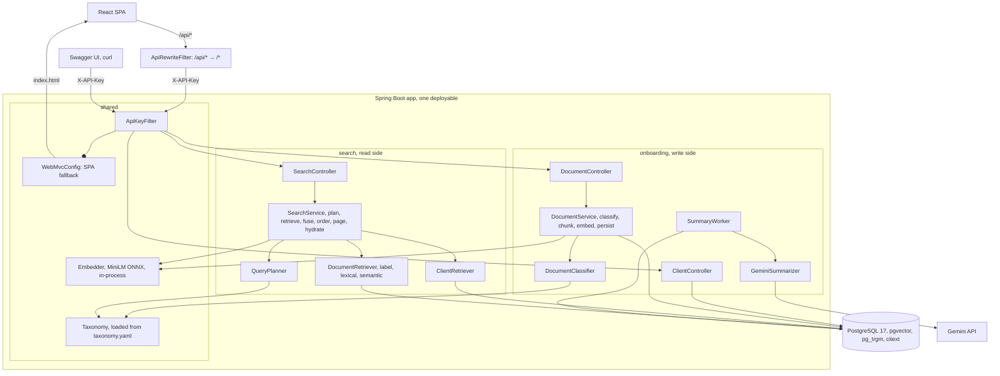
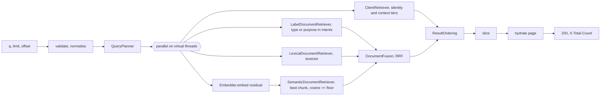

# Unified Search, System Design v2

One Spring Boot service (Java 25) on one PostgreSQL 17 database with `pgvector`, `pg_trgm` and `citext`. Runs locally with `docker compose up`. A React SPA serves as the primary UI; Swagger UI is available for API exploration. No broker, cache, ANN index or second service.

- **Documents carry a type and a set of KYC purposes** from a closed taxonomy (§3), assigned at ingest by a deterministic classifier. This is the signal v1 lacked.
- **Every query is parsed into a plan** before retrieval (§6.1). The plan names the mentioned client if any, the residual text, and the taxonomy labels the residual refers to.
- **Clients** are matched with `pg_trgm` `word_similarity`. Identity fields (name, email, social links) and the context field (description) form two tiers (§6.2).
- **Documents** are retrieved by three signals, label match, lexical match on a `tsvector`, and semantic match on MiniLM chunks in `pgvector`, then fused with reciprocal rank fusion (§6.3, §6.4).
- **Ordering** is a deterministic tier order selected by the plan shape (§6.5). Scores are never compared across types.
- **Writes** are searchable on `201`. **Summaries** stay on request through Gemini and never touch search (§7).

### 0.1 Why v2 **(v2)**

v1 failed 4 of 8 eval queries. Replacing MiniLM with E5 reproduced the same failures, which rules out the model. The cause is structural. v1 had two surface-similarity signals and no representation of what a document is *for*.

| Query | v1 result | Cause | v2 fix |
|---|---|---|---|
| `tax residency` | Council Tax Bills first | The bills literally say "confirming liability and residency". Exact word overlap beats meaning for any embedding model | Purpose labels. The bills are `proof_of_address`, the W-9 and tax return are `tax_status`. The planner maps "tax residency" to `tax_status`, and label matches lead |
| `source of funds` | Engagement letter first | The completion statement's "source and amount of funds" sentence sits in a chunk full of GBP figures. Max-pooled 50-word chunks are fragile | Purpose label `source_of_funds`, lexical retrieval over content and labels, and one label chunk per document (§5.3) |
| `proof of address` | 5 of 7 found | Samuel's bill and statement never say "occupancy" or "residency". v1 could only find documents written with proof-of-address wording | Label retrieval admits every document tagged `proof_of_address` regardless of wording |
| `advisory fees` | Client Grace Kim first | Her description contains "advisory arrangements", `word_similarity` scores 0.64 against it, and v1 put every client above every document | Description hits form a context tier ranked below documents. Only identity fields outrank documents |

Two eval defects hid the picture. A "top 3" assertion cannot pass for a query with seven correct answers, and the compound case had a single test query. §11.3 replaces both.

---

## 1. Architecture

### 1.1 Component view



### 1.2 Package layout

```
com.example.searchapp
├── onboarding/            WRITE side
│   ├── controller/        ClientController, DocumentController
│   ├── dto/               CreateClientRequest, CreateDocumentRequest
│   ├── entity/            Client, Document
│   ├── repository/        ClientRepository, DocumentRepository
│   ├── service/           DocumentService, Chunker, Chunk, EmbeddedChunk,
│   │                      DocumentClassifier, Reclassifier (v2),
│   │                      SummaryWorker, Summarizer, GeminiSummarizer
│   ├── exception/         OnboardingExceptionHandler, *NotFoundException, DuplicateClientEmailException
│   └── seed/              DemoSeeder
├── search/                READ side
│   ├── controller/        SearchController
│   ├── dto/               SearchRequest, SearchResult, match types
│   ├── planner/           QueryPlanner, QueryPlan, ClientMention (v2)
│   ├── repository/        ClientRetriever, LabelDocumentRetriever, LexicalDocumentRetriever,
│   │                      SemanticDocumentRetriever (v2 split)
│   └── service/           SearchService, DocumentFusion, ResultOrdering (pure functions)
└── shared/
    ├── embedding/         Embedder, one bean, warmed at startup
    ├── taxonomy/          Taxonomy, TaxonomyLoader (v2)
    └── web/               ApiKeyFilter, ApiRewriteFilter, RequestIdFilter, GlobalExceptionHandler,
                           ProblemDetails, RequestValidationException, OpenApiConfiguration, WebMvcConfig
```

There is no `ClientService`. Client creation is validate, insert, map the unique violation to `409`. `DocumentService` exists because document creation has logic (classify, chunk, embed outside the transaction, write atomically).

### 1.3 Module boundary

`onboarding` and `search` run in one process and never import each other. `search` reads `client`, `document` and `document_chunk` with its own SQL and its own row types. Nothing crosses the boundary in memory. Splitting into two services later is routing and role-conditional wiring, not a rewrite.

**Three contracts exist between the modules, and only one has a compiler behind it.**

1. **The schema**, versioned by Flyway.
2. **The vector space.** Query and document vectors are comparable only from the same model. Enforced in data by `document_chunk.embedding_model`, filtered at query time. A same-dimension model swap without re-index would otherwise compute nonsense silently.
3. **The taxonomy (v2).** The classifier writes labels from `taxonomy.yaml`, the planner reads the same file. Enforced in data by `document.taxonomy_version`. Changing the file requires a reclassification pass (§3.4), otherwise stored labels and query intents drift apart.

### 1.4 Technology choices

| Concern | Choice | Why | Rejected |
|---|---|---|---|
| Runtime | Java 25, Spring Boot 4.1 | Already in the repo. Virtual threads, ProblemDetail, Actuator built in | Quarkus, Micronaut |
| Data access | `JdbcClient` + `com.pgvector:pgvector` | Every interesting query is native SQL (trigram, vector, tsvector, `DISTINCT ON`) | JPA, would be bypassed everywhere |
| Migrations | Flyway | Explicit, versioned | `ddl-auto` |
| Embeddings | `dev.langchain4j:langchain4j-embeddings-all-minilm-l6-v2` (ONNX, model inside the jar) | Nothing downloads at runtime. Only this module, not the framework. Pinned `1.20.0-beta30`, imported by `Embedder` alone | DJL, Spring AI Transformers (downloads at runtime) |
| Lexical documents **(v2)** | Postgres `tsvector` + GIN | Built in, stemmed, weighted fields, indexed | Elasticsearch, BM25 library, a second store for one signal |
| Classification **(v2)** | Rule-based over title and content, taxonomy in YAML | Deterministic, zero latency, testable, no credentials. KYC document types are a small stable vocabulary | LLM at ingest (adds a network call and a credential to `POST`, breaks the zero-credential local run) |
| Summaries | `com.google.genai:google-genai`, API key | One env var for a reviewer. Vertex + ADC is the production shape | Spring AI |
| API docs | springdoc, code-first | Cannot drift from the controllers | Design-first YAML |
| Tests | JUnit 6, Testcontainers `pgvector/pgvector:pg17` | Real extensions | H2 |
| UI | React SPA (Vite, React Router) | Served from the Spring Boot jar; calls API through `/api/*` prefix via `ApiRewriteFilter` | Swagger-only |

---

## 2. Data model

### 2.1 Schema

`V1__init.sql` (unchanged)

```sql
CREATE EXTENSION IF NOT EXISTS vector;
CREATE EXTENSION IF NOT EXISTS pg_trgm;
CREATE EXTENSION IF NOT EXISTS citext;

CREATE TABLE client (
    id           uuid PRIMARY KEY DEFAULT gen_random_uuid(),
    first_name   text NOT NULL,
    last_name    text NOT NULL,
    email        citext NOT NULL,
    description  text,
    social_links text[] NOT NULL DEFAULT '{}',
    created_at   timestamptz NOT NULL DEFAULT now(),
    CONSTRAINT client_email_uk UNIQUE (email)
);

CREATE TABLE document (
    id                  uuid PRIMARY KEY DEFAULT gen_random_uuid(),
    client_id           uuid NOT NULL REFERENCES client (id) ON DELETE CASCADE,
    title               text NOT NULL,
    content             text NOT NULL,
    summary             text,
    summary_status      text NOT NULL DEFAULT 'none'
                        CHECK (summary_status IN ('none', 'pending', 'ready', 'failed')),
    summary_attempts    smallint NOT NULL DEFAULT 0,
    summary_lease_until timestamptz,
    created_at          timestamptz NOT NULL DEFAULT now()
);
CREATE INDEX document_client_idx  ON document (client_id, created_at);
CREATE INDEX document_pending_idx ON document (created_at) WHERE summary_status = 'pending';

CREATE TABLE document_chunk (
    document_id     uuid NOT NULL REFERENCES document (id) ON DELETE CASCADE,
    embedding_model text NOT NULL,
    ordinal         int  NOT NULL,
    start_offset    int  NOT NULL,   -- code-point offsets into document.content
    end_offset      int  NOT NULL,
    embedding       vector(384) NOT NULL,
    PRIMARY KEY (document_id, embedding_model, ordinal)
);
```

`V2__taxonomy.sql` **(v2)**

```sql
ALTER TABLE document
    ADD COLUMN document_type         text   NOT NULL DEFAULT 'unknown',
    ADD COLUMN purposes              text[] NOT NULL DEFAULT '{}',
    ADD COLUMN classification_source text   NOT NULL DEFAULT 'unknown'
        CHECK (classification_source IN ('request', 'rule', 'llm', 'unknown')),
    ADD COLUMN taxonomy_version      int    NOT NULL DEFAULT 0,
    ADD COLUMN label_text            text   NOT NULL DEFAULT '',
    ADD COLUMN tsv tsvector GENERATED ALWAYS AS (
        setweight(to_tsvector('english', title),      'A') ||
        setweight(to_tsvector('english', label_text), 'A') ||
        setweight(to_tsvector('english', content),    'C')) STORED;

CREATE INDEX document_tsv_idx      ON document USING GIN (tsv);
CREATE INDEX document_type_idx     ON document (document_type);
CREATE INDEX document_purposes_idx ON document USING GIN (purposes);

ALTER TABLE document_chunk
    ADD COLUMN kind text NOT NULL DEFAULT 'body' CHECK (kind IN ('label', 'body'));
ALTER TABLE document_chunk DROP CONSTRAINT document_chunk_pkey;
ALTER TABLE document_chunk ADD PRIMARY KEY (document_id, embedding_model, kind, ordinal);
```

- `document_type` and `purposes` are validated against the taxonomy in the application, not by `CHECK`, so the vocabulary lives in one file. `unknown` is a legal type with no purposes.
- `label_text` is the human-readable form of the labels ("utility bill proof of address"), written by the service so the generated `tsv` can include it. `array_to_string` is `STABLE` and cannot appear in a generated column, which is why the text is materialised.
- One `english` configuration everywhere, so a query term and a label term with the same stem produce the same lexeme. Mixing `simple` for labels with `english` for queries would silently break label matching on any inflected word.
- `embedding_model` stays in the primary key so a re-index can write new-model chunks beside the old ones and cut over by changing the query filter.
- Existing rows get `taxonomy_version = 0` and are reclassified on startup (§3.4).

### 2.2 Invariants

| Invariant | Enforced by |
|---|---|
| Email unique, case-insensitive | `UNIQUE (email)` on `citext` → `409` |
| Every document is searchable | Document, its label chunk and ≥ 1 body chunk for the current model are inserted in one transaction |
| Stored and query vectors come from the same model | `embedding_model` written at insert, filtered at query time. A mismatch returns nothing, never nonsense |
| Stored labels and query intents share a vocabulary **(v2)** | `taxonomy_version` on every document. Rows below the current version are reclassified at startup (§3.4). Briefly stale, never absent |
| Closed sets | `CHECK` on `summary_status`, `classification_source`, `kind`. Taxonomy names validated in code |
| Clients and documents are create-only | No update or delete endpoint. Reclassification is the one internal write to an existing row and changes labels only |

---

## 3. Taxonomy **(v2)**

### 3.1 Vocabulary

Twelve document types, seven purposes, one `unknown`. Purposes are the KYC question a document answers. A type has default purposes; a request may override them.

| Type | Default purposes | Title patterns | Content patterns |
|---|---|---|---|
| `utility_bill` | `proof_of_address` | utility bill, energy, electricity, gas bill, water bill | kwh, meter, supply address, standing charge |
| `council_tax_bill` | `proof_of_address` | council tax | council tax, valuation band |
| `bank_statement` | `proof_of_address` | account statement, bank statement | opening balance, closing balance, sort code |
| `tenancy_agreement` | `proof_of_address` | tenancy, lease | landlord, tenant, deposit |
| `passport` | `proof_of_identity` | passport | passport number, nationality |
| `driving_licence` | `proof_of_identity` | driving licence, driver's licence, driver licence | licence number, entitlement |
| `w9` | `tax_status` | w-9, w9, taxpayer identification | backup withholding, fatca |
| `tax_return` | `tax_status` | tax return, self assessment | taxpayer reference, income tax |
| `completion_statement` | `source_of_funds` | completion statement | sale proceeds, conveyancing, completion |
| `engagement_letter` | `fees_and_terms` | engagement letter, terms of business | assets under management, terminate this arrangement |
| `investment_policy_statement` | `investment_mandate` | investment policy | asset allocation, risk profile |
| `trust_deed` | `trust_structure` | trust deed, deed of amendment | trustee, settlor, beneficiar |

| Purpose | Query synonyms |
|---|---|
| `proof_of_address` | proof of address, address proof, proof of residence, residency evidence, address verification |
| `proof_of_identity` | proof of identity, identity document, photo id, id document, identification |
| `source_of_funds` | source of funds, source of wealth, origin of funds, where the money came from, sale proceeds |
| `tax_status` | tax residency, tax residence, tax status, tax form, fatca, crs, self certification |
| `fees_and_terms` | advisory fees, fees, charges, fee schedule, fee agreement, engagement |
| `investment_mandate` | risk tolerance, risk profile, investment mandate, asset allocation, investment objectives |
| `trust_structure` | trust restructuring, trust structure, trustees, beneficiaries, trust |

Each type and purpose has a human-readable `label` in the YAML (`utility bill`, `w-9 form`, `proof of address`). Labels are what `label_text` and the label chunk are built from. Each type also has query synonyms, which are its title patterns plus short forms (`bill` → `utility_bill` and `council_tax_bill`, `statement` → `bank_statement`, `licence` → `driving_licence`, `ips` → `investment_policy_statement`).

Two mappings are product decisions, not mistakes. `bank_statement` and `tax_return` are *not* tagged `source_of_funds`, and `driving_licence` is *not* tagged `proof_of_address`, because the eval set defines "proof of address" as utility bills, council tax bills, bank and savings statements and tenancy documents, and "source of funds" as the completion statements. If compliance wants them counted, change the YAML and the eval together.

### 3.2 File

`shared/taxonomy/taxonomy.yaml`, loaded once at startup, validated (unique names, every purpose referenced by a type exists, no synonym equals a type or purpose id).

```yaml
version: 1
types:
  utility_bill:
    label: utility bill
    purposes: [proof_of_address]
    title_patterns: [utility bill, energy, electricity, gas bill, water bill]
    content_patterns: [kwh, meter, supply address, standing charge]
    synonyms: [utility bill, energy bill, electricity bill, gas bill, water bill, bill]
  # ... one entry per type
purposes:
  proof_of_address:
    label: proof of address
    synonyms: [proof of address, address proof, proof of residence, residency evidence, address verification]
  # ... one entry per purpose
```

### 3.3 Classifier

`DocumentClassifier.classify(title, content, requested)` is a pure function.

1. If the request supplies `document_type`, validate it and use it. `purposes` from the request if given, otherwise the type's defaults. Source `request`.
2. Otherwise score every type. Each title pattern found (case-insensitive substring on the normalised title) scores 2, each content pattern found scores 1. Take the highest. A best score of 0, or a tie for first place, yields `unknown`. Source `rule`.
3. `purposes` = the type's defaults. `label_text` = type label followed by purpose labels, space separated. Empty for `unknown`.
4. `taxonomy_version` = the file's version.

Deterministic and unit-tested against every seed document (§11.1). An LLM classifier is deliberately not in the write path (§1.4, §13).

### 3.4 Reclassification

`Reclassifier` runs at startup in `onboarding`, after Flyway and before the seeder. It selects `document` rows with `taxonomy_version < current` in batches of 100, re-runs rule classification for rows whose source is `rule` or `unknown`, refreshes `label_text` and `taxonomy_version` for every row (including `request` rows, whose type is kept), and rewrites the label chunk (§5.3). One transaction per batch, idempotent, safe to interrupt. Readiness does not wait for it. Stale rows search under old labels for the seconds it takes, which is the same "briefly stale, never absent" contract as a re-index.

---

## 4. API contract

JSON is `snake_case`. Errors are RFC 9457 `application/problem+json`. IDs are UUID strings, timestamps ISO-8601 UTC. Auth header `X-API-Key`.

### 4.1 Endpoints

| Method and path | Module | Success | Errors | Notes |
|---|---|---|---|---|
| `POST /clients` | onboarding | `201`, `Location`, `Client` | `400`, `401`, `409` | |
| `GET /clients` | onboarding | `200` `Client[]` | `401` | Debugging aid: every client, oldest first, unpaginated |
| `GET /clients/{id}` | onboarding | `200` `Client` | `400`, `401`, `404` | |
| `GET /clients/{id}/documents` | onboarding | `200` `Document[]` | `400`, `401`, `404` | Lists all documents for a client, newest first |
| `POST /clients/{id}/documents` | onboarding | `201`, `Location`, `Document` | `400`, `401`, `404` | Optional `document_type`, `purposes` **(v2)**. Never calls a model |
| `GET /clients/{id}/documents/{documentId}` | onboarding | `200` `Document` | `400`, `401`, `404` | Never triggers a summary |
| `POST /clients/{id}/documents/{documentId}/summary` | onboarding | `202` `Document` | `400`, `401`, `404` | `none` or `failed` → `pending`. Already `pending` → `202` no-op. `ready` → `200` no-op |
| `GET /search?q=&limit=&offset=` | search | `200` `SearchResult[]`, `X-Total-Count` | `400`, `401` | `[]` when nothing qualifies, never `404` |
| `GET /health` | shared | `200` | | Unauthenticated |
| `GET /v3/api-docs`, `/swagger-ui/**` | shared | `200` | | Unauthenticated |
| `GET /` | shared | `200` `index.html` | | Serves the React SPA |
| `GET /api/*` | shared | Rewritten to `/*` | | `ApiRewriteFilter` maps `/api/search` → `/search` etc. |

The SPA home route lists all clients as responsive tiles (with a create-client tile first) until a query is supplied through the persistent header search field. A query calls `GET /api/search`; a client tile opens its detail route. The create-client route writes the client, then each optional title/content document entry through the existing onboarding endpoints. It intentionally does not upload files: the API accepts document content as text (§4.2).

A missing id is `404`. A malformed UUID in a path is `400`, a bad request rather than a missing record. An unknown route is `404` with the same generic body as any other.

### 4.2 Validation

Strings are trimmed first. Required means non-blank after trimming.

| Field | Rule |
|---|---|
| `first_name`, `last_name` | required, ≤ 100 chars |
| `email` | required, valid address with a `.` in the domain, ≤ 254 chars |
| `description` | optional, ≤ 2 000 chars |
| `social_links` | optional, ≤ 10 absolute `http(s)` URLs, each ≤ 2 048 chars |
| `title` | required, ≤ 300 chars |
| `content` | required, ≤ 64 000 chars |
| `document_type` **(v2)** | optional, must be a taxonomy type id |
| `purposes` **(v2)** | optional, each a taxonomy purpose id, only allowed together with `document_type` |
| `q` | required, 1 to 200 chars after trimming |
| `limit` | 1 to 50, default 20 |
| `offset` | ≥ 0, default 0 |

Requests declaring `Content-Length` over 256 KB get `413` before binding.

### 4.3 Response schemas

`Client` = brief schema plus `created_at`.
`Document` = brief schema plus `summary`, `summary_status`, and **(v2)** `document_type`, `purposes`, `classification_source`.

`SearchResult` is a discriminated union on `type`.

```json
[
  {
    "type": "client",
    "score": 0.833333,
    "match": { "field": "email", "tier": "identity" },
    "client": { "id": "7b0e…", "first_name": "John", "last_name": "Doe",
                "email": "john.doe@neviswealth.com", "description": "…",
                "social_links": ["https://www.linkedin.com/company/neviswealth"],
                "created_at": "2026-09-17T10:00:00Z" }
  },
  {
    "type": "document",
    "score": 0.032787,
    "match": { "passage": "…Registered supply address: Flat 4, 22 Willowmead Crescent…",
               "signals": ["label", "lexical", "semantic"],
               "labels": ["purpose:proof_of_address"] },
    "document": { "id": "c41a…", "client_id": "7b0e…", "client_name": "John Doe",
                  "title": "2024 Utility Bill", "document_type": "utility_bill",
                  "purposes": ["proof_of_address"], "summary": null, "summary_status": "none",
                  "created_at": "2026-09-17T10:05:00Z" }
  }
]
```

- `match.field` ∈ `name | email | social_links | description`. `match.tier` ∈ `identity | context` **(v2)**.
- `match.signals` **(v2)** lists which of `label`, `lexical`, `semantic` admitted the document. `match.labels` lists the taxonomy labels that matched the query's intents. Both exist so a wrong ranking can be explained from the response alone.
- Document results omit `content`. The passage plus `GET` covers display. `client_name` makes a document attributable without a second call.
- `score` is comparable within a type only. Clients carry `word_similarity`, documents carry the fused score (§6.4). Position is decided by §6.5, never by comparing scores across types.

### 4.4 Pagination

The response is an array, the total is in `X-Total-Count`. Each retriever fetches at most 200 candidates, so the total is exact below that and a lower bound at it. Ordering is total (§6.5), so a page is a slice and deep pages are stable.

---

## 5. Write path

### 5.1 Create client

Validate → `INSERT … RETURNING *` → map `client_email_uk` violation to `409` → `201`. Searchable immediately, the client retriever reads base columns.

### 5.2 Create document **(v2 additions)**

1. Validate, check the client exists (`404`).
2. `classification = DocumentClassifier.classify(title, content, requested)`.
3. `chunks = Chunker.split(content)`.
4. Embed outside any transaction. Body chunk input is `title + "\n\n" + chunk text`. Label chunk input is `title + "\n" + label_text` (title alone for `unknown`).
5. One transaction. Insert the document row with type, purposes, source, version and `label_text`, then the label chunk (`kind = 'label'`, `ordinal = 0`, offsets 0 and 0), then the body chunks (`kind = 'body'`, `ordinal` 1..n).
6. `201` with `Location`.

No model call, no network. Creation latency is embedding plus one transaction.

### 5.3 Chunker and label chunk

- Whitespace tokens with code-point offsets. Window 50 words, stride 40. A document of ≤ 50 words is one chunk.
- The bundled tokenizer truncates silently past **126 word pieces**, measured with the model's own tokenizer, not the 256 usually quoted. Dense KYC text reaches ~2 word pieces per word, so 50 words plus title does not exceed the ceiling. The bound is asserted in a test, not assumed.
- **Label chunk (v2).** One extra vector per document that says what the document is, in the same space as the query. It gives the semantic signal a clean target for paraphrases the synonym list does not cover ("where did the money come from") and is immune to the chunk-dilution failure in §0.1. It never serves as a passage (§6.6).

---

## 6. Search path

### 6.1 Flow and query plan **(v2)**



If any retriever fails the request returns `500`. Partial results would make documents vanish with nothing to show why.

**Normalisation.** Lowercase, Unicode NFKC, strip possessives (`john's`, `john’s` → `john`), collapse whitespace, keep intra-token hyphens (`w-9`) and also index the de-hyphenated form (`w9`).

**Plan.** `QueryPlanner.plan(q)` returns the normalised whole-query text, `mentions`, `residual`,
and `intents`. The client retriever reads the whole query; every document retriever reads the
residual.

- **Mention.** Tokens are compared in order against every client's `first_name || ' ' || last_name` and `email` with `word_similarity ≥ 0.69` (just under the measured `Hendersen → Henderson` 0.70). Only the leading contiguous run of matching tokens counts, so in `john utility bill` matching stops at `utility` and a later `bill` can never become a client named Bill. Tokens under three characters are skipped. The clients whose leading run is longest are the `mentions`: `john doe utility bill` names John Doe (two tokens) over John Smith (one), so `mentions` holds one client. Two or more clients tied on the longest run mean the name is ambiguous and `mentions` holds all of them (`john utility bill` mentions every John), because the query still names a small, known set of people and their documents are the likeliest answers. Their tokens are consumed like any mention, so the residual is `utility bill`, not `john utility bill`.
- **Ambiguity rule.** A single-token mention (unique or tied) whose token is also a taxonomy synonym (`bill`, `statement`, `trust`) counts as a mention only if the token was possessive (`bill's`) or a second token also matched the same client (`bill carter`). Otherwise the token is treated as category text.
- **Residual.** The tokens after the mentions. Empty for an identity query (`john`, `neviswealth`, `hendersen`).
- **Intents.** Longest-match, non-overlapping phrase search of the residual against all type and purpose synonyms. `completion statement` matches the type, not `statement`. Result is a set of type ids and purpose ids, possibly empty.

Two thresholds beyond v1's floors, both fixed. Mention 0.69 is measured. Intent matching is exact on normalised phrases, no fuzzy threshold in v2 (§13).

### 6.2 Client retriever **(v2 tiers)**

```sql
SELECT c.id, best.field, best.tier, best.score
FROM client c
CROSS JOIN LATERAL (
    SELECT field, tier, score
    FROM (VALUES
        ('name',         'identity', word_similarity(:q, c.first_name || ' ' || c.last_name)),
        ('email',        'identity', word_similarity(:q, c.email::text)),
        ('social_links', 'identity', word_similarity(:q, array_to_string(c.social_links, ' '))),
        ('description',  'context',  word_similarity(:q, coalesce(c.description, '')))
    ) AS f(field, tier, score)
    WHERE score >= :lexicalFloor
    ORDER BY (tier = 'identity') DESC, score DESC
    LIMIT 1
) best
ORDER BY (best.tier = 'identity') DESC, best.score DESC, c.last_name, c.id
LIMIT 200;
```

- `pg_trgm` lowercases and splits on non-alphanumerics, so `john.doe@neviswealth.com` is already `john`, `doe`, `neviswealth`, `com`. Delimiter decomposition, partial tokens and typo tolerance come from one built-in.
- `lexicalFloor` is **0.6**, pg_trgm's default, guarded by the eval and never derived from it. Measured anchors, `NevisWealth → email` 1.0, `Hendersen → Henderson` 0.70, `passport → email` 0.00.
- **Identity beats context.** A name, email or company URL hit is the advisor naming a record they know exists. A description hit (`advisory fees → "advisory arrangements"`, 0.64) is weak evidence and ranks below documents in §6.5. This is the fix for the fourth v1 failure and it costs no threshold change.
- No trigram index. Escape hatch is GIN `gin_trgm_ops` per field, added on measurement.
- **Known limits.** Transpositions and single substitutions in short names (`jhon` 0.20, `joe` 0.50 against `John Doe`) cannot clear any floor J2 survives. `fuzzystrmatch` Levenshtein is the follow-up (§13).

### 6.3 Document retrievers **(v2)**

All three take `plan.residual`. When the residual is empty, or non-empty but reduces to an empty tsquery (stop words only, `the and`), none of them runs and the result holds clients only. An embedding of stop words would admit documents on noise, so the check is made once, before the fan-out, rather than per retriever.

**Label.** Admits every document whose stored labels match a query intent. Wording-independent, which is what fixes `proof of address`.

```sql
SELECT id, document_type, purposes, created_at
FROM document
WHERE document_type = ANY(:types) OR purposes && :purposes
ORDER BY created_at DESC, id
LIMIT 200;
```

**Lexical.** Stemmed match over title, labels and content, ranked by cover density.

```sql
SELECT d.id, ts_rank_cd(d.tsv, tq, 32) AS score
FROM document d, websearch_to_tsquery('english', :residual) tq
WHERE d.tsv @@ tq
ORDER BY score DESC, d.id
LIMIT 200;
```

`websearch_to_tsquery` ANDs terms, which keeps precision. Recall comes from the other two signals.

**Semantic.** Best chunk per document over label and body chunks, above the floor.

```sql
SELECT document_id, similarity
FROM (
    SELECT DISTINCT ON (document_id)
           document_id, 1 - (embedding <=> :qvec) AS similarity
    FROM document_chunk
    WHERE embedding_model = :embeddingModel
    ORDER BY document_id, embedding <=> :qvec
) best
WHERE similarity >= :semanticFloor
ORDER BY similarity DESC, document_id
LIMIT 200;
```

- Exact scan, no index. ~10⁴ documents × ~4 chunks is ~4×10⁴ distance computations.
- `embedding_model` is bound from the live `Embedder`. A model change without re-index matches nothing, loudly.
- `semanticFloor` is a **recall gate**, currently 0.238, re-derived by the eval over both label and body chunks as the midpoint between the lowest positive and highest negative cosine (§11.3). With label and lexical admission it is no longer the only thing standing between a relevant document and the result list, which is the point. It does not separate near-domain noise from paraphrase recall, see the known limits in §13.
- Future path when the scan exceeds budget, HNSW plus a top-K rewrite.

### 6.4 Fusion **(v2)**

Documents now have more than one signal, so rank fusion is meaningful (it was not in v1, where the two retrievers covered disjoint corpora).

```
candidates = label ∪ lexical ∪ semantic
fused(d)   = Σ over lists L ∈ {lexical, semantic} where d ∈ L of  1 / (60 + rank_L(d))
labelMatch(d) = d ∈ label
sort key   = (labelMatch desc, fused desc, cosine desc nulls last, created_at desc, id)
```

- Reciprocal rank fusion, `k = 60`, over the two *ranked* lists. Label admission is a tier flag, not a score, because "is tagged proof of address" is boolean evidence and mixing it into a sum would need a weight nobody can justify.
- A document admitted by label alone has `fused = 0` and sorts by cosine when it was scanned, then recency. It still precedes every untagged document.
- No normalised score blend. `ts_rank_cd` and cosine live on unrelated scales.

### 6.5 Ordering **(v2)**

`ResultOrdering` is a pure function of the plan, the two client tiers `I` (identity, whole-query `word_similarity ≥ 0.6` on name, email or social links) and `X` (context, description), and the fused document list `D` (already sorted by §6.4, tagged matches first). The plan selects one of two shapes.

**Shape A, no mentions.** Covers category queries (`utility bill`), free text, and identity hits the mention detector cannot see because it only reads names and emails (`linkedin.com/company/neviswealth` scores 1.0 against John's social link but no token clears 0.69 against his name or email).

| Tier | Content | Why |
|---|---|---|
| 1 | `I` | Naming a record is the highest-precision signal in the system |
| 2 | `D` | The answer to a category or free-text query, tagged matches before untagged |
| 3 | `X` | Weak evidence, shown but never above the documents it would otherwise hide |

**Shape B, one or more mentions.** Covers identity queries (`John`, `NevisWealth`, `Hendersen`, residual empty so `D` is empty) and compound queries (`John's bill`, `John utility bill`). With one mention the client is a qualifier. With several tied mentions every tied client's documents are treated as equally likely and keep their §6.4 order among themselves.

| Tier | Content | Why |
|---|---|---|
| 1 | `D` where `client_id` is a mentioned client | In a compound query the client is a qualifier and the document is the target |
| 2 | The mentioned clients, in mention order | Confirms who was recognised, even when the whole query did not clear the identity floor (`john utility bill` scores 0.28 against `John Doe`) |
| 3 | `D` where `client_id` is not a mentioned client | Fallback when the advisor named the wrong person or the client has no such document |
| 4 | `I` minus the mentioned clients | Rare, another client whose identity also matches the whole query |
| 5 | `X` | As in Shape A |

```
order(plan, I, X, D) =
    plan.mentions == {}
        ? I ++ D ++ X
        : D[client in M] ++ M ++ D[client not in M] ++ (I \ M) ++ X      where M = plan.mentions
```

Properties. Total and deterministic, so pagination is a slice. No score is compared across types. A mention has no filtering authority, it only reorders documents that qualified through §6.3. Two or more clients tied on the longest matched run are all in `M`, so a shared first name promotes every one of those clients' qualified documents instead of leaving them buried among every other client's.

**Worked examples on the seed corpus**

| Query | Plan | Top of the list |
|---|---|---|
| `John` | mentions John Doe and John Whitfield (tied), residual empty | Both Johns (identity, name) |
| `John utility bill` | mentions both Johns (tied), residual `utility bill`, intents {utility_bill} | John Doe's 2024 Utility Bill, John Whitfield's Electricity Bill Oct to Dec 2026, their other qualifying documents, both Johns, then everyone else's bills |
| `NevisWealth` | mention John via email 1.0, residual empty | John (identity, email) |
| `Hendersen` | mention Mary 0.70, residual empty | Mary |
| `utility bill` | no mention, intents {utility_bill} | John's bill, Samuel's bill (label + lexical + semantic), then other documents, zero clients |
| `John's bill` | mentions John Doe and John Whitfield (tied), residual `bill`, intents {utility_bill, council_tax_bill} | John Doe's 2024 Utility Bill, John Whitfield's Electricity Bill Oct to Dec 2026, the two Johns, then the other bills |
| `Bill's statement` | mention Bill Carter (possessive lifts the ambiguity rule), intents {bank_statement} | Bill's Current Account Statement, Bill Carter, Samuel's statement |
| `bill` | ambiguity rule blocks the mention, whole-query identity hit on Bill Carter, intents {utility_bill, council_tax_bill} | Bill Carter, then the four bills |
| `tax residency` | intents {tax_status} | Mary's W-9, Bill's Tax Return, then Council Tax Bills (untagged for this intent), zero clients |
| `source of funds` | intents {source_of_funds} | Elena's Property Sale Completion Statement, zero clients |
| `proof of address` | intents {proof_of_address} | every tagged document (53 in the seed corpus), zero clients |
| `advisory fees` | intents {fees_and_terms} | two Advisory Engagement Letters, then Grace Kim (context tier, description) |

### 6.6 Hydration

Two queries per page. Clients by id. Documents by id with the passage computed as the best **body** chunk for the query, so a passage always shows document text and never the label chunk.

```sql
SELECT * FROM client WHERE id = ANY(:ids);

SELECT d.id, d.client_id, c.first_name || ' ' || c.last_name AS client_name,
       d.title, d.document_type, d.purposes, d.summary, d.summary_status, d.created_at,
       substr(d.content, p.start_offset + 1, p.end_offset - p.start_offset) AS passage
FROM document d
JOIN client c ON c.id = d.client_id
JOIN LATERAL (
    SELECT start_offset, end_offset
    FROM document_chunk dc
    WHERE dc.document_id = d.id AND dc.kind = 'body' AND dc.embedding_model = :embeddingModel
    ORDER BY dc.embedding <=> :qvec
    LIMIT 1
) p ON true
WHERE d.id = ANY(:ids);
```

≤ 50 documents × a few chunks per page, negligible. Offsets are code points on both sides. Results are re-ordered in memory to the §6.5 order.

---

## 7. Summaries

On request only. `POST …/summary` moves `none` or `failed` to `pending` and resets attempts, in one guarded `UPDATE`, so repeated clicks cannot double-enqueue. The `document` table is the queue.

- **Claim.** `UPDATE … SET summary_attempts + 1, summary_lease_until = now() + 2 min WHERE id IN (SELECT … pending AND attempts < 3 AND lease expired ORDER BY created_at LIMIT 5 FOR UPDATE SKIP LOCKED)`. Attempts increment at claim, so a crash mid-call still consumes one.
- **Call.** Gemini, 20 s timeout, outside any transaction. Prompt asks for a 2 to 3 sentence factual summary and treats document text as data.
- **Complete.** `UPDATE … SET summary, status 'ready' WHERE id = :id AND status = 'pending'`.
- **Triggers.** A nudge from the request handler plus a `@Scheduled` sweep every 30 s, which doubles as retry backoff and marks exhausted rows `failed`.
- **Degradation.** Without `GEMINI_API_KEY` the summarizer throws a permanent error, so a requested summary goes `pending → failed` within one nudge. Observable, not hidden.
- **Isolation.** Search never reads `summary`. A summary failure has no path to search.

---

## 8. Security

- `ApiKeyFilter` compares `X-API-Key` against `API_KEY` with `MessageDigest.isEqual`. Startup fails if the key is unset or under 32 characters. Allowlist `GET /health`, `/v3/api-docs/**`, `/swagger-ui/**`, `/`, `/index.html`, and all static asset extensions (`.js`, `.css`, `.png`, `.svg`, `.ico`, `.woff2`). Spring Security rejected as oversized for one static key.
- `ApiRewriteFilter` rewrites `GET /api/search?q=…` to `GET /search?q=…` so the SPA calls a consistent `/api/*` prefix without the backend changing its endpoint paths.
- The SPA stores the API key in `localStorage` after the user types it into the API Key modal. It is never hard-coded in the bundle or served from the server.
- Every query parameter is bound, never interpolated, including `:residual`, `:types` and `:purposes`.
- `social_links` restricted to `http(s)` at write time. User text is returned verbatim as JSON strings, escaping is the renderer's job.
- Errors never carry stack traces, SQL or constraint names.
- Secrets from env only. Compose ships a dev-only `API_KEY` so a clean clone runs with zero credentials. `GEMINI_API_KEY` optional, server-side only.
- Swagger UI declares the API-key scheme so **Authorize** sends the header. The key is typed into the browser, never served to it.

---

## 9. Observability

| Signal | Content |
|---|---|
| Logs | Structured JSON, `request_id` from `X-Cloud-Trace-Context` or generated, echoed as `X-Request-Id` |
| Search audit line | `request_id`, `query_length`, **(v2)** `plan_shape` (`identity`, `compound`, `document`), `intent_count`, `mention_present`, per-retriever hit counts, `returned`, per-stage timings. Query text is never logged by the service, it is routinely PII. The eval's report (§11.3) logs its synthetic fixture queries |
| Write lines | IDs, `document_type`, `classification_source`, chunk count, embed time. Never names, emails, titles or content |
| Worker lines | `document_id`, attempt, outcome, error class, latency |
| Metrics | Timers `search.plan`, `search.clients`, `search.label`, `search.lexical`, `search.embed_query`, `search.semantic`, `search.total`, `document.embed`, `summary.call`. Counters `summary.outcome{status}`, **(v2)** `classification.outcome{type,source}` |
| Health | Readiness includes DB connectivity and a warmed model (one inference at startup) |

---

## 10. Deployment

Local is the only built target. `docker compose up` starts `pgvector/pgvector:pg17` with a healthcheck and the app depending on it. Three-stage Dockerfile: a Node 22 Alpine stage builds the React SPA, a `gradle:9.7.1-jdk25` stage builds the jar, and `eclipse-temurin:25-jre` is the runtime. Non-root, `-XX:MaxRAMPercentage=60`. The model and the SPA are inside the jar.

`./gradlew composeBuild` rebuilds the images with `--no-cache --pull`. `./gradlew composeRedeploy` runs that, then `docker compose up -d --force-recreate --wait`. The Postgres volume is kept; use `docker compose down -v` to reset data.

For local development without Docker, run `cd frontend && npm run build` first (or `./gradlew buildFrontend`), then `./gradlew bootRun`. During frontend development, `cd frontend && npm run dev` starts a Vite dev server on port 3000 that proxies `/api` to the backend on port 8080.

| Env var | Default | Purpose |
|---|---|---|
| `DB_URL`, `DB_USER`, `DB_PASSWORD` | compose values | JDBC |
| `API_KEY` | dev-only compose default | Static API key, override in `.env` |
| `GEMINI_API_KEY` | absent | Enables summaries |
| `SUMMARY_MODEL` | current Gemini Flash id | Model ids retire on Google's schedule |
| `SEED_ENABLED` | `true` | Seed when `client` is empty |

`semanticFloor` lives in `application.yaml`. `lexicalFloor`, the mention threshold and the RRF constant are code constants, not deployment knobs.

**Seeding.** `DemoSeeder` loads `seed/corpus.json` through `ClientRepository` and `DocumentService`, so seed documents are classified, chunked and embedded by the production path. Runs after `Reclassifier`.

**GCP, documented, not built.** One Cloud Run service (2 vCPU, 2 GiB, `min-instances=1`, `max-instances=2`, CPU always allocated so the summary sweep is not throttled), Cloud SQL Postgres 17 on a dedicated vCPU, secrets from Secret Manager, summaries through Vertex with ADC. The lease in §7 is what makes more than one instance correct. Migrations are additive-only so a split `search` keeps working across an `onboarding` rollout.

---

## 11. Testing

### 11.1 Unit (no containers)

- `QueryPlanner` **(v2)**, a table of queries → expected plan. Includes every worked example in §6.5, possessives, the ambiguity rule, ambiguous double mention, stop-word-only residual, `w-9`.
- `DocumentClassifier` **(v2)**, every seed document classifies to its expected type from `eval/classification.json`, no ties, and a handful of `unknown` cases.
- `TaxonomyLoader` **(v2)**, rejects duplicate ids, unknown purpose references, synonyms equal to ids.
- `DocumentFusion` and `ResultOrdering` **(v2)**, both shapes, label tier before untagged, mention not in `I` still inserted, `I minus mention` has no duplicate, empty residual yields clients only, order is total.
- `Chunker`, offsets, overlap, single chunk, surrogate pairs.
- Request validation, `ApiKeyFilter`.
- Frontend API client: client listing and the client-then-document write sequence, run with `cd frontend && npm test`.
- Embedding-backed (one model load per JVM), the 126 word-piece bound and the semantic floor gap.

### 11.2 Integration (Testcontainers, full context, real model)

| Test | Asserts |
|---|---|
| J1 | `NevisWealth` → John first, `match.field = email`, `tier = identity` |
| J2 | `address proof` → every address document (53 in the seed corpus) in the first 53 positions, no client above any of them |
| J3 | `Hendersen` → Mary first |
| Identity over documents | A query hitting a client's email and a document lexically returns the client first |
| Context under documents **(v2)** | `advisory fees` → engagement letters lead, Grace Kim present and below them |
| Compound **(v2)** | `John Doe utility bill`, `Bill's statement`, `Mary's tax form` → the named client's expected document first, then only that client's own documents, then the client, then other clients' documents (§6.5 tier 1 then tier 2) |
| Ambiguity rule **(v2)** | `bill` → Bill Carter first, bills after. `Bill's statement` → Bill's statement first |
| Label admission **(v2)** | A document tagged `proof_of_address` whose text contains none of the query words is returned for `proof of address` |
| Label chunk **(v2)** | A paraphrase absent from the synonym list still returns the tagged document through the semantic signal |
| Classification on create **(v2)** | `POST` a utility bill → `document_type = utility_bill`, `purposes = [proof_of_address]`, `source = rule`. With `document_type` in the request → `source = request` |
| Reclassification **(v2)** | A row inserted at `taxonomy_version = 0` is at the current version after startup, with a label chunk |
| Passage | Passage is body text, never label text, and comes from the best body chunk |
| Semantic floor | A document below the floor with no lexical or label hit is absent |
| Model guard | Chunks under another `embedding_model` are invisible |
| Retriever failure | Any failing retriever → RFC 9457 `500`, never partial results |
| Searchable on 201, long documents, pagination, empty result, contract codes, auth | As v1 |
| Summaries | Not auto-started, request, retry after `failed`, degradation, lease exclusivity. As v1 |

### 11.3 Relevance evaluation set **(v2)**

`src/test/resources/eval/` holds `corpus.json` (also the seed), `classification.json` (expected type per document) and `queries.json`.

Each query declares one expectation shape.

| Shape | Assertion |
|---|---|
| `first` | The named client or document is at position 1 |
| `all_within` (n expected items) | Every expected item appears in the first n positions, i.e. recall@n = 1 |
| `compound` | Expected document first, then only that client's own documents, then the expected client. A client's other documents that clear a signal are tier 1 (§6.5) and may sit between the two, so "second" holds only when no other document of that client qualified |
| `none` | Zero results |

Every document query additionally asserts **no client is ranked above any expected document**. This generalises v1's zero-client guard and still lets a context-tier client appear below the answers. MRR and recall@n are logged for every run.

Expected items are hand-labelled from the taxonomy's definition of what answers the question (§3.1), never read back from a search result. `queries.json` names shared answer sets (`proof_of_address` is 53 documents, so `address proof` and `proof of address` are `all_within 53`) and lets an entry name a title alone, meaning every document with that title.

Queries at the current 50-client, 126-document corpus.

- `first`: `NevisWealth` (John Doe), `Hendersen` (Mary Henderson), `bill` (Bill Carter), `letter of authority`.
- `all_within`: `John` (both Johns, 2), `address proof` and `proof of address` (53), `utility bill` (13), `tax residency` (14), `source of funds` (5), `advisory fees` (12), `proof of identity` (22), `risk tolerance` (8), `trust restructuring` (6), `W-9` (2).
- `compound`: possessive `Bill's statement`, `Mary's tax form`, `Elena's completion statement`, and bare `John Doe utility bill`, `Priya Shah tenancy`. Mentions are unambiguous on purpose. Ambiguous names are covered by the `all_within` and `first` entries below.
- Tied mentions (§6.1): `John utility bill` and `John's bill` are `all_within 2` (John Doe's 2024 Utility Bill and John Whitfield's Electricity Bill Oct to Dec 2026), and `Priya tenancy` (Priya Shah and Priyanka Raman tie) is `first` Priya Shah's Assured Shorthold Tenancy Agreement. Before tied mentions their reciprocal ranks were 0.50, 0.17 and 0.14 (best expected document at rank 2, 6 and 7). After, all three are 1.0, and over the 28-query set MRR went from 0.905 to 1.000 and mean recall@n from 0.848 to 0.957.
- `none`: five out-of-domain queries. `weather forecast for the weekend` was replaced by `how to bake sourdough bread` because `weather` is a substring of the client Zoë Fairweather and trigram `word_similarity` admits her on the email. This is a known limit of the lexical floor, not a fixed bug, and the old eval only asserted "no documents" so it never saw it.

`semanticFloor` is set by this test as the midpoint of the gap between the lowest positive and highest negative cosine (currently 0.2917 and 0.1836, midpoint 0.2377), and the build fails if the gap closes or if `application.yaml` drifts from the midpoint. `lexicalFloor` stays 0.6 and is guarded from both sides at the endpoint: `Hendersen` (0.70) is admitted and `joe` (0.50) is not. The classifier must reach 100% on `classification.json`.

**Known gap.** The two Broadband and Landline bills are genuine address evidence but classify `unknown` (§3.1), so they are not in the `proof_of_address` set and never surface for that query. Adding `broadband` to the `utility_bill` title patterns would close it, together with `classification.json` and the eval.

---

## 12. Performance and capacity

Estimates, unverified. Micrometer timers in §9 are the measurement hook.

| Stage | Estimate | Note |
|---|---|---|
| Plan | < 1 ms | In-process, ~100 synonym phrases |
| Query embedding | 5 to 15 ms | Parallel with the others |
| Client SQL | 5 to 15 ms | Sequential scan, 10³ clients × 4 trigram comparisons |
| Label SQL | < 2 ms | Indexed on type and purposes |
| Lexical SQL | 1 to 5 ms | GIN on `tsv` |
| Semantic SQL | 25 to 75 ms | Exact scan over ~4×10⁴ chunks (label chunk adds ~25%) |
| Fusion, ordering, hydration | 3 to 8 ms | |
| **Total** | **~45 to 110 ms** | Budget p99 < 300 ms |

Document creation is embedding plus one transaction, 10 to 50 ms typical, up to ~1 s at the 64 000-character cap (~265 body chunks). Cost is linear in length, which is why the cap and the 1 s target are one constraint.

Scale triggers, unchanged from v1. Semantic p95 over ~100 ms → HNSW and a top-K rewrite. Client SQL p95 over ~30 ms → GIN `gin_trgm_ops`. Writes slowing search → split the modules into services. Documents larger than the cap → a second async ingestion mode that gives up searchable-on-`201`. Multi-tenancy → tenant column, scoped uniqueness, RLS.

---

## 13. Follow-ups and ideas not adopted **(v2)**

Ordered by expected value. None is in v2 scope.

1. **Async LLM classification.** Reuse the summary worker pattern to have Gemini classify documents the rules left `unknown`, writing `classification_source = llm`. Never in the write path, so the zero-credential local run and the `201` latency stay intact.
2. **Prototype embeddings for intents.** Embed each purpose's synonym list into one prototype vector at startup and detect an intent when the residual's cosine to a prototype clears a calibrated floor with a margin over the runner-up. Catches paraphrases the synonym list misses. Calibrate on the eval, or it becomes a new source of false intents.
3. **Typo-tolerant intents.** `word_similarity ≥ 0.8` between residual and synonym phrases (`residancy evidence`). Cheap, needs eval negatives to prove it does not over-fire.
4. **Cross-encoder rerank** of the top 50 documents once ranking quality plateaus. First place where a second model earns its cost.
5. **Levenshtein for short names.** `fuzzystrmatch` for transpositions and single substitutions (`jhon`, `joe`). Wider false-match surface, gate it behind a length limit.
6. **Trailing mentions.** `utility bill for John` puts the client last. Allow a mention at either end when the middle tokens are all intents or stop words.
7. **Filters on `/search`.** `client_id`, `document_type`, `purpose` query parameters for a future UI. The label retriever already does the work.
8. **Browse tier for identity queries.** `John` could return John followed by his documents by recency. A product decision, because it changes what a search result means.
9. **Sentence-aware chunking.** Cut windows at sentence boundaries so the one sentence that answers a query is never split across chunks.
10. **Summary as a chunk.** Embed a ready summary as `kind = 'summary'`. Purpose-oriented text embeds well, but it couples summaries to search, which v1 kept apart on purpose.
11. **Click logging** on result position to find missing synonyms and mis-tagged documents from real usage.
12. **Frontend debounce.** A request per keystroke would multiply the estimated 10 to 30 searches per second for 100 advisers. The current SPA debounces at 300 ms.

Known limits carried forward. Short-name typos (§6.2), one- or two-character queries, English-only synonyms and stemming, a synonym that is also a client's name is resolved by the ambiguity rule and nothing smarter.

**The semantic floor is a coarse gate, and no single cosine threshold is right.** Measured on the seed corpus with MiniLM. Near-domain out-of-corpus queries score higher than the floor: `cheap hotel deals in Rome` 0.328 (closest chunk, the Dutch lease), `weekend flight to Lisbon` 0.297 (a passport). Paraphrase queries with no taxonomy synonym score as low as 0.345 for `paper showing the home address` and 0.12 for one electricity bill under `evidence of where the client lives`. The two ranges overlap, so raising the floor would drop real paraphrase hits before it dropped travel noise, and the gap the eval derives from easy negatives does not survive harder ones. Such hits are admitted by the semantic signal alone and rank below every label and lexical hit (§6.4). The remedies are follow-ups 2 and 4, not a tuned number.

---

## 14. Implementation plan (delta from v1)

Each step leaves a runnable system with a green build. Steps 1-7 are v2, step 8 is the frontend.


1. **Taxonomy.** `taxonomy.yaml`, `Taxonomy`, `TaxonomyLoader`, validation tests.
2. **Schema and classification.** `V2__taxonomy.sql`, `DocumentClassifier`, `label_text`, label chunk in `DocumentService`, `Reclassifier` at startup, `classification.json`, 100% on the seed corpus. Request fields `document_type` and `purposes`.
3. **Planner.** Normalisation, mention detection with the ambiguity rule, intents. Table-driven unit tests from §6.5.
4. **Retrievers.** `ClientRetriever` tiers, `LabelDocumentRetriever`, `LexicalDocumentRetriever`, `SemanticDocumentRetriever` over both chunk kinds.
5. **Fusion and ordering.** `DocumentFusion` (RRF), `ResultOrdering` v2, hydration with best body chunk, response schema changes (`tier`, `signals`, `labels`, document type fields).
6. **Eval v2.** `queries.json` with expectation shapes, the no-client-above-answers guard, recall@n and MRR, floor re-derivation. Every v1 failure in §0.1 must pass.
7. **Docs.** README examples for identity, category and compound queries, the taxonomy file as the place to add a document type, and the reclassification behaviour.
8. **Frontend (React SPA).** Vite + React Router SPA served from the Spring Boot jar. The persistent header search calls `/api/search`; its home route shows responsive client tiles and a create-client tile. Four pages: home/search (`/`), create client (`/clients/new`), client detail (`/clients/:id`), document detail (`/clients/:id/documents/:docId`). API calls through `/api/*` prefix. `ApiRewriteFilter` rewrites `/api/search` → `/search` etc. `WebMvcConfig` serves `index.html` for SPA routes. `ApiKeyFilter` allowlists static assets. `GET /clients/{id}/documents` added to list a client's documents.
